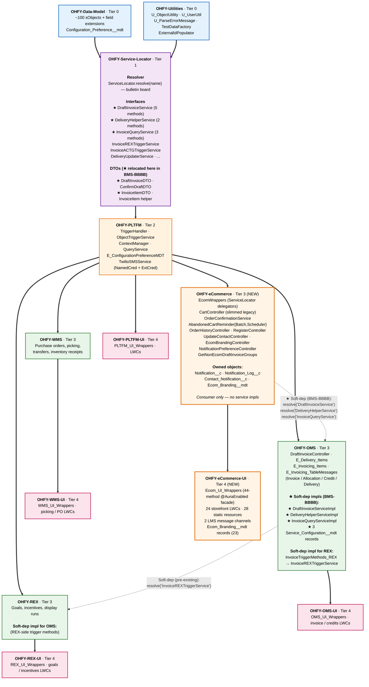
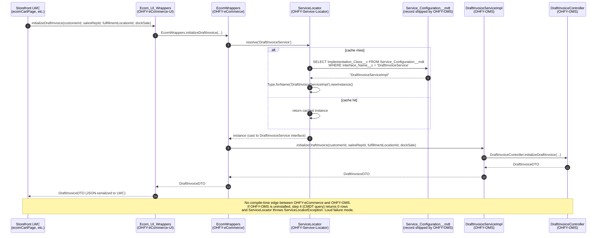
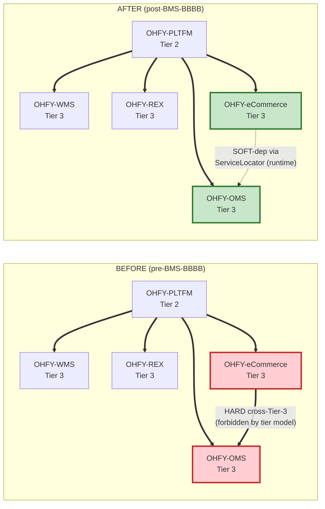

# Post OMS→OHFY-Service-Locator — soft-dep refactor rundown (BMS-BBBB)


## TL;DR

- **Before:** OHFY-eCommerce had a hard, compile-time dependency on OHFY-OMS. Ecom code called `DraftInvoiceController.initializeDraftInvoice(...)` directly. That dependency was the first cross-Tier-3 edge in the repo and broke the parallel-siblings invariant.
- **After:** OHFY-eCommerce resolves OMS services at runtime through `ServiceLocator.resolve('DraftInvoiceService')` etc. No compile-time reference to OMS. The OHFY-OMS line is gone from OHFY-eCommerce's `sfdx-project.json` dependencies. Tier-3 packages are siblings again.
- **Scope:** 52 file changes, ~1,960 net lines removed, 12 method call-sites virtualized.

## Visual — tier package model (post-BMS-BBBB)

Solid arrows = compile-time dependencies (declared in `sfdx-project.json`).
Dotted arrows = runtime-only soft dependencies resolved via `ServiceLocator.resolve(...)`.
★ marks anything new in BMS-BBBB.



## Visual — runtime call flow

What actually happens at runtime when `Ecom_UI_Wrappers.initializeDraftInvoice(...)` is called from an LWC. Note that **PLTFM never appears in this path** — it's just a compile-time tier dependency for the packages involved. The call routes through **Service-Locator** (the bulletin board).



## Visual — before vs. after (the cross-Tier-3 edge removed)



## Why we did this

1. **Architectural cleanliness.** OMS / WMS / REX have always been mutually independent at Tier 3. Adding OHFY-eCommerce as a Tier-3 package that *depended on* OMS would have created the first cross-Tier-3 edge and set a precedent that every future Tier-3 domain could build on top of an existing one — turning the parallel-siblings model into a tangled graph.
2. **Customer install footprint.** With soft-dep, an OHFY-eCommerce customer who doesn't also buy OHFY-OMS can install ecom alone. The runtime resolve will throw a clear `ServiceLocatorException` instead of compile-time failures. Easier to support "ecom-only" SKUs later.
3. **Swappable OMS implementation.** If a customer wants ecom but with a different invoice engine (custom rules, integration to NetSuite/SAP, etc.), they ship a different `DraftInvoiceService` implementation registered through the same `Service_Configuration__mdt` record. Ecom doesn't know or care which impl is wired up.
4. **Testability.** Tests can register mock impls without OMS being involved.

## Why Service-Locator, not PLTFM

The original plan (in [[service-locator-pattern]]) said "move DTOs to OHFY-PLTFM." That doesn't actually work because of tier mechanics:

- The 3 new interfaces (`DraftInvoiceService`, `DeliveryHelperService`, `InvoiceQueryService`) live in **OHFY-Service-Locator** (Tier 1) — that's where the existing pattern (`InvoiceREXTriggerService`, etc.) puts them.
- The interface method signatures reference `DraftInvoiceDTO`, `ConfirmDraftDTO`, `InvoiceItemDTO`. For the interface to compile, those types must be **visible to Service-Locator at compile time**.
- Service-Locator depends on Tier 0 only. It **cannot reference PLTFM types** (PLTFM is Tier 2, above Service-Locator). The dependency would be circular.
- Therefore the DTOs had to land **at Tier 0 or Tier 1** — Service-Locator (Tier 1) was chosen because the DTOs naturally co-locate with the interface contract that uses them.

This deviation from the original plan is the cleanest fix; the alternative was redefining all interface methods to return `Map<String, Object>` (losing type safety).

## What moved where

| Item                                                                                                              | From                                     | To                                                             | Phase |
| ----------------------------------------------------------------------------------------------------------------- | ---------------------------------------- | -------------------------------------------------------------- | ----- |
| `DraftInvoiceDTO` + `_T`                                                                                          | `OHFY-OMS/.../classes/DTOs/invoice/`     | `OHFY-Service-Locator/.../classes/DTOs/invoice/`               | A     |
| `ConfirmDraftDTO` + `_T`                                                                                          | same                                     | same                                                           | A     |
| `InvoiceItemDTO` + `_T`                                                                                           | `OHFY-OMS/.../classes/DTOs/invoiceItem/` | `OHFY-Service-Locator/.../classes/DTOs/invoiceItem/`           | A     |
| `InvoiceItem` (helper) + `_T`                                                                                     | same                                     | same                                                           | A     |
| `DraftInvoiceService` interface (5 methods)                                                                       | — (new)                                  | `OHFY-Service-Locator/.../classes/serviceInterfaces/invoice/`  | B     |
| `DeliveryHelperService` interface (2 methods)                                                                     | — (new)                                  | `OHFY-Service-Locator/.../classes/serviceInterfaces/delivery/` | B     |
| `InvoiceQueryService` interface (3 methods)                                                                       | — (new)                                  | `OHFY-Service-Locator/.../classes/serviceInterfaces/invoice/`  | B     |
| `DraftInvoiceServiceImpl`                                                                                         | — (new)                                  | `OHFY-OMS/.../classes/services/invoice/`                       | C     |
| `DeliveryHelperServiceImpl`                                                                                       | — (new)                                  | `OHFY-OMS/.../classes/services/delivery/`                      | C     |
| `InvoiceQueryServiceImpl`                                                                                         | — (new)                                  | `OHFY-OMS/.../classes/services/invoice/`                       | C     |
| `Service_Configuration.Draft_Invoice_Service.md-meta.xml`                                                         | — (new)                                  | `OHFY-OMS/.../customMetadata/serviceConfiguration/`            | D     |
| `Service_Configuration.Delivery_Helper_Service.md-meta.xml`                                                       | — (new)                                  | same                                                           | D     |
| `Service_Configuration.Invoice_Query_Service.md-meta.xml`                                                         | — (new)                                  | same                                                           | D     |
| `EcomWrappers.cls` rewritten as ServiceLocator delegators                                                         | OHFY-eCommerce (in place)                | OHFY-eCommerce (in place)                                      | E     |
| `CartController.cls` — 6 inline duplicates deleted, replaced with thin ServiceLocator delegators (−322 net lines) | OHFY-eCommerce (in place)                | OHFY-eCommerce (in place)                                      | E     |
| `Ecom_UI_Wrappers.cls` — `pricelistId` arg dropped from `initializeDraftInvoice*`                                 | OHFY-eCommerce-UI (in place)             | OHFY-eCommerce-UI (in place)                                   | E     |
| `draftInvoiceService.js` — `pricelistId` arg dropped from `_fetchDraft()` call site                               | OHFY-eCommerce-UI (in place)             | OHFY-eCommerce-UI (in place)                                   | E     |
| `sfdx-project.json` — OHFY-OMS removed from both ecom packages' dependencies                                      | (root)                                   | (root, in place)                                               | F     |

## The 12 virtualized call-sites

These are now `((InterfaceName) ServiceLocator.resolve('InterfaceName')).method(...)` rather than direct OMS class references:

**Routed through `DraftInvoiceService` (7 methods):**
- `EcomWrappers.initializeDraftInvoice` → `DraftInvoiceController.initializeDraftInvoice`
- `EcomWrappers.initializeDraftInvoice_Ecom` → same canonical
- `EcomWrappers.onInvoiceItemChange` → `DraftInvoiceController.onInvoiceItemChange`
- `EcomWrappers.updateDraftInvoice` → `DraftInvoiceController.updateDraftInvoice`
- `EcomWrappers.confirmDrafts` → `DraftInvoiceController.confirmDrafts`
- `EcomWrappers.confirmDrafts_ECOM` → same canonical
- `CartController.createAccountItem` → `DraftInvoiceController.createAccountItem`

**Routed through `DeliveryHelperService` (2 methods):**
- `CartController.checkLockedDelivery` → `E_Delivery_Items.checkLockedDelivery`
- `CartController.getNextAvailableDeliveryDate` → `E_Delivery_Items.getNextAvailableDeliveryDate`

**Routed through `InvoiceQueryService` (3 methods):**
- `CartController.getQuantityAvailableAtFulfillmentLocation` → `E_Invoicing_Items.getQuantityAvailableAtFulfillmentLocation`
- `CartController.getTerritoryExclusions` → `E_Invoicing_Items.getTerritoryExclusions`
- `CartController.setDeliveryMessage` → `E_Invoicing_TableMessages.setDeliveryMessage`

## Pre-existing bug fixed in the process

`initializeDraftInvoice` was being called by ecom with **5 arguments** (including `pricelistId`), but the canonical `DraftInvoiceController.initializeDraftInvoice` only accepts **4 arguments** (no `pricelistId`). The ecom code wouldn't compile against the current OMS canonical.

Resolution applied: dropped `pricelistId` from the ecom call chain to match the 4-arg canonical. Pricelist is now derived server-side from the customer record. Affected files:
- `EcomWrappers.cls` — both `initializeDraftInvoice` and `initializeDraftInvoice_Ecom`
- `Ecom_UI_Wrappers.cls` — both LWC-facing methods
- `draftInvoiceService.js` — `_fetchDraft()` no longer passes `pricelistId`

## Outstanding — methods that should also go through the service locator

### `getBrands` — not yet virtualized

Originally classified as "no OMS counterpart found" during the duplicate audit. Re-classified as a copy after the user spotted the canonical:

| Ecom method | OHFY-OMS canonical | Used where |
|---|---|---|
| `CartController.getBrands(List<Pricelist_Item__c> priceListItems)` | `E_Invoicing_Items.getBrandsForItems(List<Id> itemTypeIds)` | Storefront brand-filter sidebar |

Signatures don't quite line up — ecom takes pricelist-item records, OMS takes pre-extracted item-type IDs. So this isn't a 1:1 delegation; the wrapper needs to extract `itemTypeIds` from the pricelist-item records first, then call the canonical.

**To wire this through the soft-dep pattern, three small edits:**

1. **Add method to `InvoiceQueryService` interface** in OHFY-Service-Locator:
   ```apex
   List<Item_Type__c> getBrandsForItems(List<Id> itemTypeIds);
   ```

2. **Add implementation to `InvoiceQueryServiceImpl`** in OHFY-OMS:
   ```apex
   @namespaceAccessible
   global List<Item_Type__c> getBrandsForItems(List<Id> itemTypeIds) {
       return E_Invoicing_Items.getBrandsForItems(itemTypeIds);
   }
   ```

3. **Rewire `CartController.getBrands`** to extract item-type IDs first, then resolve and delegate:
   ```apex
   @namespaceAccessible
   public static List<Item_Type__c> getBrands(List<Pricelist_Item__c> priceListItems) {
       List<Id> itemTypeIds = new List<Id>();
       for (Pricelist_Item__c pli : priceListItems) {
           if (pli.Item__r != null && pli.Item__r.Item_Type__c != null) {
               itemTypeIds.add(pli.Item__r.Item_Type__c);
           }
       }
       return ((InvoiceQueryService) ServiceLocator.resolve('InvoiceQueryService'))
           .getBrandsForItems(itemTypeIds);
   }
   ```

**Audit needed first:** confirm `E_Invoicing_Items.getBrandsForItems(itemTypeIds)` does the same `Item_Type__c` lookup that the ecom inline body currently does. If the canonical applies additional filters (active, deleted, etc.) that ecom doesn't apply (or vice versa), the semantics diverge and the ecom inline should stay.

**Effort estimate:** ~10 minutes once audited. Smallest possible "Phase E extension" to BMS-BBBB.

### Other CartController methods that weren't in BMS-BBBB scope

These were classified as "genuinely ecom-specific" in the original audit. Worth re-checking each for OMS counterparts in `E_Promotions`, `E_Invoicing_Items`, etc.:

- `getPromotionCriteriaQuantities(List<Id>, List<Id>)`
- `getPromotionJunctions(List<Id>)`
- `getItemIdToPromotionsMap(List<Id>, List<Id>, Map, List<Id>, Boolean)`
- `getOrderConfirmation(Id, String)`
- `fixEcomOrderNames(Id, String)`
- `getMinimumCaseQuantity(Id)` — uses `E_ConfigurationPreferenceMDT` (in PLTFM); already routes downstream correctly
- `addDraftItems(String, Id)` — uses `InvoiceItem.toInvoiceItemSObject` (now in Service-Locator); already correct
- `clearDraftItems(List<Id>)` — manipulates `Invoice_Item__c` directly via SOQL; no OMS class call

A grep pass against `E_Promotions`, `E_Invoice*`, and `E_Order*` would surface any hidden canonicals.

## Runtime mechanics (for review)

When `EcomWrappers.initializeDraftInvoice(...)` is called:

1. `ServiceLocator.resolve('DraftInvoiceService')` checks its in-memory cache.
2. Cache miss → query `Service_Configuration__mdt WHERE Interface_Name__c = 'DraftInvoiceService'` → finds the record we created in OHFY-OMS pointing at `DraftInvoiceServiceImpl`.
3. `Type.forName('DraftInvoiceServiceImpl').newInstance()` instantiates the impl at runtime. No compile-time reference.
4. Cast to `DraftInvoiceService` interface (compile-safe since both sides see the interface from Service-Locator).
5. Call `.initializeDraftInvoice(customerId, salesRepId, fulfillmentLocationId, dockSale)`.
6. The impl delegates to `DraftInvoiceController.initializeDraftInvoice(...)` — that part is OMS-internal.

**Caching:** `serviceCache` is a static `Map` — lives for the duration of a single Apex transaction (one request, one async job, one trigger context). Next transaction re-queries the CMDT. So the CMDT lookup cost is amortized per-transaction, not per-org.

**Test setup:** `ServiceLocator.isTest = false` by default → tests query the real CMDT. The CMDT records we created seed correctly during tests. No mock setup needed in `_T` classes unless they want to substitute a different impl.

## Verification checklist (before pushing this PR)

- [ ] `npm run prettier` then `npm run prettier:verify`
- [ ] `npm run lint`
- [ ] `npm test`
- [ ] `sf project deploy validate -d OHFY-Service-Locator/force-app -o <alias> -l RunSpecifiedTests -t "DraftInvoiceDTO_T,ConfirmDraftDTO_T,InvoiceItemDTO_T,InvoiceItem_T,ServiceLocator_T" -w 30`
- [ ] `sf project deploy validate -d OHFY-OMS/force-app -o <alias> -l RunSpecifiedTests -t "DraftInvoiceController_T,E_Delivery_Items_T,E_Invoicing_Items_T" -w 30`
- [ ] `sf project deploy validate -d OHFY-eCommerce/force-app -o <alias> -l RunSpecifiedTests -t "EcomWrappers_T,CartController_T,OrderConfirmationService_T" -w 30` *(run whichever ecom `_T` classes do exist)*
- [ ] Full-stack scratch-org deploy: `bash utilityScripts/claim-dev.sh -a soft-dep-test && npm run deploy:full -- --target-org soft-dep-test`
- [ ] Smoke the storefront end-to-end: shop → cart → checkout (exercises 7+ of the 12 virtualized methods)

## Related notes

- [[service-locator-pattern]] — full pattern walkthrough, REX example, and OMS↔REX canonical case
- [[✅ may12th-ECOM->SPLIT]] — companion note covering the field-extension reclassification done the same day, plus the Apex duplicate audit that identified the 12 methods that ended up in BMS-BBBB scope
