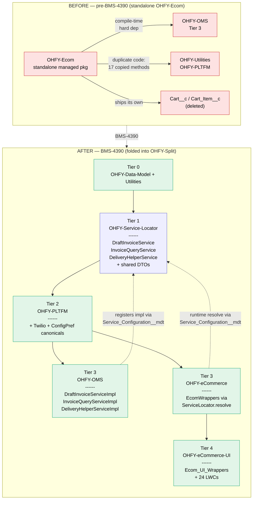

# Hand-off — Folding OHFY-Ecom into OHFY-Split (BMS-4390)

## Objective

Retire the standalone `OHFY-Ecom` managed package and re-home its surface inside the OHFY-Split mono-repo as two new Tier-aligned packages — `OHFY-eCommerce` (Tier 3 backend) and `OHFY-eCommerce-UI` (Tier 4 UI) — mirroring the established OMS/OMS-UI and WMS/WMS-UI shape.

Two non-negotiable constraints drove every decision on this branch:

1. **No cross-Tier-3 hard dependency.** eCommerce sits alongside OMS / WMS / REX. It must not compile-time-depend on any of them, or customers who install eCommerce will be forced to install OMS.
2. **No duplicate code.** The original `OHFY-Ecom` source held ~17 verbatim copies of functions that already lived in OHFY-Utilities, OHFY-PLTFM, and OHFY-OMS. Each one is a future drift hazard. They needed to route at the canonical, not get re-copied into the split.

## What's done (in order, with evidence)

### 1. Package fold — commit `7fa22c18`

`feat(ecom): fold OHFY-Ecom into OHFY-Split as eCommerce + eCommerce-UI packages`

- **OHFY-eCommerce** (new Tier-3 package): 14 production Apex classes, all `@namespaceAccessible`. Owns the storefront-only objects (`Notification__c`, `Notification_Log__c`, `Contact_Notification__c`), `Ecom_Branding__mdt` (23 records), 3 ecom `Configuration_Preference` records, and the genuinely-ecom-only field extensions on shared objects.
- **OHFY-eCommerce-UI** (new Tier-4 package): `Ecom_UI_Wrappers` 44-method `@AuraEnabled` facade + 24 LWCs + 28 static resources + 2 LMS message channels.
- **OHFY-Data-Model** picks up 8 truly-core field extensions (`Account.State_License_Number / Alcohol_License_Required`, `Item__c.ATF_1..4`, `Location__c.Warehouse_Cutoff_Time`). See `may12th-ECOM->SPLIT.md` § "Moves applied today" for the field-by-field rationale.
- **OHFY-PLTFM** absorbs Twilio (`TwilioSMSService` + Named/External credential). Class and 5 public methods marked `@namespaceAccessible` so ecom (and any future OMS-side caller) reach across the boundary.
- Playwright storefront specs relocated to `test-automation/tests/ecom/`.
- Pre-split source archived to `_archive/OHFY-eCommerce-pre-split-2026-05-10/` (gitignored, ~4.5 GB).

### 2. Lower-tier duplicate cleanup — folded into the fold commit

Two quick-wins land before the soft-dep refactor because they touch only dependencies that already exist (Tier 0 + Tier 2):

- **OHFY-Utilities passthroughs (5 methods removed).** `CartController.getFilteredRecords`, `getRecordsByMultipleFields`, `getRecordAndFields`, `getGroupedSumByDate`, `getUserInstance` deleted. `Ecom_UI_Wrappers` routes directly at `U_ObjectUtility.*` and `U_UserUtil.getUserInstance`. CartController: −117 lines. Tests: −76 lines.
- **OHFY-PLTFM ConfigPref consolidation.** `EcomConfigurationPreferenceMDT` (class + tests, ~130 lines) deleted entirely. All ecom callers — `OrderConfirmationService` (2 sites), `CartController.getMinimumCaseQuantity`, `Ecom_UI_Wrappers.getMetadataActiveStatus` — rewired at `E_ConfigurationPreferenceMDT` in PLTFM. `EcomConfigurationPreferenceTestSetup.applyDefaults()` rewritten to seed the canonical's `@TestVisible` map. Net: **+74 / −385 = 311 lines removed**.

### 3. Soft-dep refactor — uncommitted on local working tree (BMS-BBBB)

This is the load-bearing piece of the branch. The cross-Tier-3 edge from eCommerce → OMS is eliminated by inserting Tier-1 interfaces and resolving them at runtime through `ServiceLocator`.

**New in `OHFY-Service-Locator`:**

| File                                                        | Purpose                                                                                                                      |
| ----------------------------------------------------------- | ---------------------------------------------------------------------------------------------------------------------------- |
| `serviceInterfaces/invoice/DraftInvoiceService.cls`         | Contract for `initializeDraftInvoice`, `onInvoiceItemChange`, `updateDraftInvoice`, `confirmDrafts`                          |
| `serviceInterfaces/invoice/InvoiceQueryService.cls`         | Contract for `getQuantityAvailableAtFulfillmentLocation`, `getTerritoryExclusions`                                           |
| `serviceInterfaces/delivery/DeliveryHelperService.cls`      | Contract for `checkLockedDelivery`, `getNextAvailableDeliveryDate`, `setDeliveryMessage`, `createAccountItem`                |
| `DTOs/invoice/{DraftInvoiceDTO,ConfirmDraftDTO}.cls` + `_T` | Moved from OHFY-OMS — these are shared LWC-serializable carriers, must live in Tier 1 so both eCommerce and OMS can see them |
| `DTOs/invoiceItem/{InvoiceItemDTO,InvoiceItem}.cls` + `_T`  | Same — moved from OHFY-OMS to OHFY-Service-Locator                                                                           |

**New in `OHFY-OMS`:**

| File                                              | Purpose                                                                                           |
| ------------------------------------------------- | ------------------------------------------------------------------------------------------------- |
| `services/invoice/DraftInvoiceServiceImpl.cls`    | Implements `DraftInvoiceService`; delegates to `DraftInvoiceController`                           |
| `services/invoice/InvoiceQueryServiceImpl.cls`    | Implements `InvoiceQueryService`; delegates to `E_Invoicing_Items` / `E_Product_Page`             |
| `services/delivery/DeliveryHelperServiceImpl.cls` | Implements `DeliveryHelperService`; delegates to `E_Delivery_Items` + `E_Invoicing_TableMessages` |
| 3 `Service_Configuration__mdt` records            | Wires each interface name to its OMS implementation class at runtime                              |

**OHFY-eCommerce rewires:**

- `EcomWrappers.cls` — rewritten as 6 thin `ServiceLocator.resolve('DraftInvoiceService')` delegators. No compile-time reference to `DraftInvoiceController` remains. Also drops `pricelistId` from `initializeDraftInvoice` (matches the 4-arg canonical; fixes a pre-existing signature mismatch).
- `CartController.cls` — 6 inline OMS duplicates (`createAccountItem`, `checkLockedDelivery`, `getNextAvailableDeliveryDate`, `getQuantityAvailableAtFulfillmentLocation`, `getTerritoryExclusions`, `setDeliveryMessage`) deleted and replaced with ServiceLocator delegators. CartController shrinks from 954 → ~700 lines.
- `Ecom_UI_Wrappers.cls` + `draftInvoiceService.js` — updated to drop `pricelistId` from the LWC-facing `initializeDraftInvoice` call.

**`sfdx-project.json`:**

- `OHFY-OMS` removed from both `OHFY-eCommerce` and `OHFY-eCommerce-UI` `dependencies` arrays. The cross-Tier-3 edge is gone — confirm with `git diff sfdx-project.json`.

### 4. Local `cherry-pick` commit `3a7ab1e9`

`Copies from OHFY-Utilities, Copies from OHFY-PLTFM` — the rebase commit that brought the lower-tier cleanup work onto this branch's history. No new production logic; just the two consolidations above.

## Net architectural shift — visual model



**Read it as:** the hard arrow from eCommerce → OMS is gone. The only path from eCommerce back into OMS-owned logic now runs through Service-Locator (Tier 1), which both packages depend on individually. eCommerce is installable without OMS; OMS still functions if eCommerce is removed (its `Service_Configuration__mdt` records are inert without callers).

## Where to pick this up

Everything in §1 and §2 is committed (`7fa22c18`, `3a7ab1e9`). Everything in §3 is on the working tree, uncommitted — see `git status`. The next engineer-actionable steps in order:

1. **Stage and commit the soft-dep refactor.** Suggested message:
    ```
    refactor(ecom): route eCommerce -> OMS through ServiceLocator [BMS-4390]

    Eliminates the cross-Tier-3 dep by introducing 3 Tier-1 interfaces
    (DraftInvoiceService, InvoiceQueryService, DeliveryHelperService),
    moving 4 shared DTOs from OHFY-OMS to OHFY-Service-Locator, and
    rewriting EcomWrappers + CartController as runtime resolvers.

    OHFY-OMS dropped from OHFY-eCommerce + OHFY-eCommerce-UI deps in
    sfdx-project.json — the edge is gone.
    ```
2. **Run `sf package create` for the two new packages** to replace the `TODO_RUN_sf_package_create_*` alias placeholders in `sfdx-project.json`. Don't push until these are real `0Ho...` IDs — CI will choke on unresolved aliases.
3. **Pre-PR validation gates** — `npm run prettier:verify` → `npm run lint` → `npm test` → `sf project deploy validate` per touched package → full-stack deploy on a claimed dev org → Playwright `test-automation/tests/ecom/`. Canonical checklist lives in `✅ may12th-ECOM->SPLIT.md` § "Pre-PR validation gates."
4. **Open the PR against `develop`.** Reference BMS-4390.

## Known follow-ups (separate tickets, scope deliberately out of this PR)

| Ticket | Scope | Notes |
|---|---|---|
| BMS-XXXX | Migrate `c/pubsub` consumers (`navigationMenu`, `ecomOrderHistory`, `ecomHomeBody`, `cartService`) to Lightning Message Service; delete `lwc/pubsub/` + `lwc/cartService/`. | Cart badge in `navigationMenu` must keep working — subscribe to `DraftInvoiceChannel` directly. |
| BMS-YYYY | Rename `CartController` — `Cart__c`/`Cart_Item__c` are gone, the name is now a lie. Candidate: `Ecom_DraftInvoice_Helpers`. | Pure rename + grep-and-replace. |
| BMS-ZZZZ | Externalize `TwilioSMSService.ACCOUNT_SID` / `FROM_NUMBER` to a new `Twilio_Settings__mdt`. | Hardcoded constants at PLTFM/TwilioSMSService.cls lines 27, 31. |

## Open judgment calls (decide before PR, or punt explicitly)

- `Account.ECOM_Minimum_Case_Quantity__c` — leave in eCommerce, or promote to Data-Model? Hinges on whether OMS ever needs to honor the storefront minimum for rep-entered orders. **Current call:** leave in eCommerce until a caller exists.
- `Invoice__c.E_Commerce__c` — leave in eCommerce, or promote to Data-Model? Hinges on whether OMS reporting ever wants to filter by storefront origin. **Current call:** leave in eCommerce.
- `test-automation/setup/auth.ecom.setup.ts` vs. global `auth.setup.ts` — both exist side-by-side. Reconcile or accept.
- `_archive/OHFY-eCommerce-pre-split-2026-05-10/` (4.5 GB, gitignored) — safe to delete locally once the PR merges.

## Reference

- Field-by-field rationale (which extensions are core vs. ecom-specific): [[✅ may12th-ECOM->SPLIT]]
- Pattern primer (how ServiceLocator works end-to-end): [[service-locator-pattern]]
- Earlier service-locator hand-off (OMS-side context): [[Post OMS->OHFY-Service-Locator]]
- Pre-split archive: `_archive/OHFY-eCommerce-pre-split-2026-05-10/` (gitignored)
