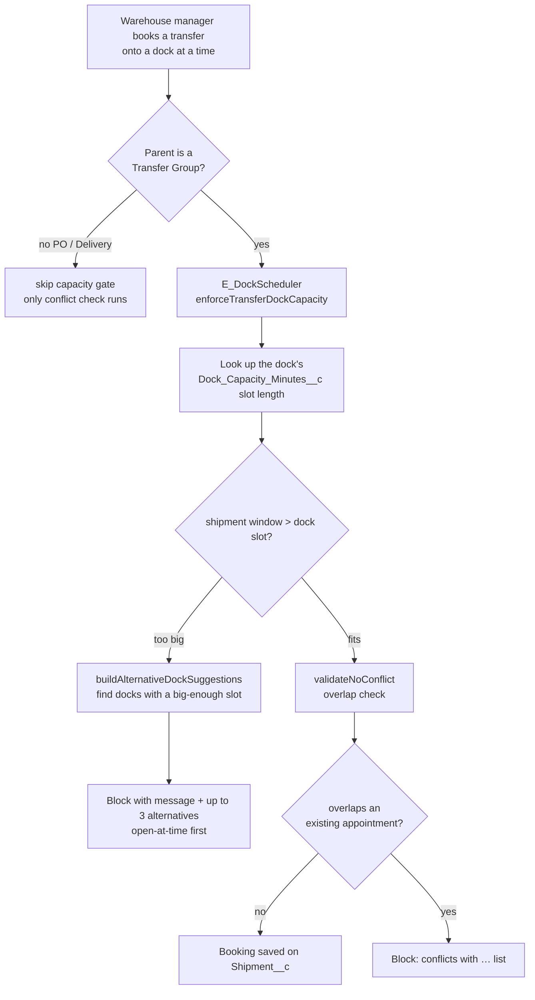
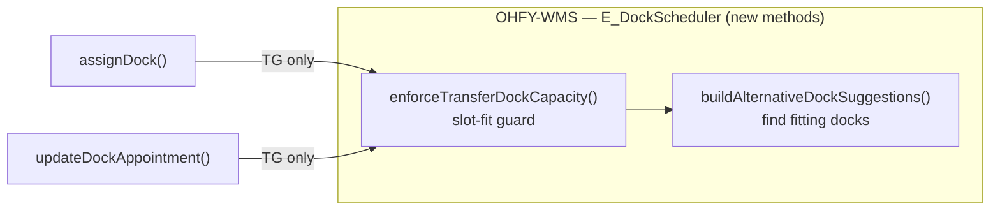

# BMS-4490 — Transfer Dock Optimization

> [!abstract] One sentence
> When a warehouse manager books a **transfer** onto a dock, if the shipment needs **more time than that dock's slot length** (or the slot is already taken), the booking is **blocked** with an explanation and **alternative docks/times that actually fit** are suggested.

---

## 1. The whole picture



**Key principle (the delta is additive):** the *existing* `validateNoConflict` remains the single authority for time-overlap conflicts. BMS-4490 adds a **capacity (slot-fit) pre-check** in front of it, **scoped to Transfer Groups only** — supplier-PO and delivery loads are untouched.

---

## 2. What existed BEFORE (the shipped dock scheduler)

> [!note] Dock *scheduling* shipped 2026-04-29. BMS-4490 is *optimization* layered on top — it does not replace anything.

| Existing piece | What it does |
|---|---|
| `Shipment__c` | One appointment record; has exactly one parent (`Delivery__c` **or** `Purchase_Order__c` **or** `Transfer_Group__c`). Holds `Origin_Dock__c`/`Origin_Dock_Time__c`, `Destination_Dock__c`/`Destination_Dock_Time__c`, and `Shipment_Time_Minutes__c` (default 60) |
| `E_DockScheduler` | The scheduler API: `getDockSchedule`, `assignDock`, `updateDockAppointment`, `validateNoConflict` (interval-overlap) |
| `ShipmentTriggerService` | Stamps `Location__c.Dock_Status__c` (e.g. "Unloading - Inbound Transfer" vs "Receiving - Inbound PO") |
| `Location__c.Dock_Capacity_Minutes__c` | **Per-operation slot length** for a dock — the UI (`dockColumn.js`) literally shows it as `MIN/SLOT` |
| `Location__c.Is_Dock__c` / `Is_Truck__c` | Marks a Location as a dock |
| `dockDashboard` / `dockColumn` / `dockAppointmentTile` / `dockTimeAxis` LWCs | The shipped scheduling UI |

**What did NOT exist:** any capacity/slot-fit check, or alternative-dock suggestion. Also note `Bypass_Dock_Conflict__c` (a supervisor-override permission) was **never implemented** — and we intentionally did not add it.

---

## 3. What BMS-4490 ADDS (the delta)



- **`enforceTransferDockCapacity(dockId, durationMins, dockTime, excludeRecordId)`** — if `durationMins > dock.Dock_Capacity_Minutes__c`, block and suggest alternatives. No-op when the dock has no configured capacity or the window fits.
- **`buildAlternativeDockSuggestions(parentLocationId, durationMins, …)`** — finds sibling docks (under the same parent warehouse) whose slot length fits, preferring ones **free at the requested time**, capped at 3.
- Wired into `assignDock` + `updateDockAppointment`, **only for Transfer-Group-parented** shipments.
- **Additive `@namespaceAccessible` methods only** — no released signature changed, no new field, no UI/DTO change (the block surfaces as the existing toast/exception).

---

## 4. What data is pulled in (exactly)

```apex
// 1) The target dock's slot length + which warehouse it belongs to
Location__c: Id, Name, Dock_Capacity_Minutes__c, Parent_Location__c
  WHERE Id = :dockId  (LIMIT 1)

// 2) (alternatives) sibling docks under the same parent warehouse with a big-enough slot
Location__c: ... WHERE Parent_Location__c = :parent AND Is_Dock__c = true
                   AND Dock_Capacity_Minutes__c >= :durationMins

// 3) (conflict authority, pre-existing) existing appointments on the dock
Shipment__c: Origin/Destination_Dock__c + _Dock_Time__c, Shipment_Time_Minutes__c,
             Delivery__r.Name/Status__c, Purchase_Order__r.Name/Status__c,
             Transfer_Group__r.Name/Status__c
  WHERE Origin_Dock__c = :dockId OR Destination_Dock__c = :dockId
```

The overlap math: a proposed window `[dockTime, dockTime + durationMins]` conflicts with an existing one `[start, start + its Shipment_Time_Minutes__c]` when `start < newEnd AND existingEnd > dockTime`. The shipment being edited is excluded by its parent record id.

---

## 5. Ambiguities — resolved (v1 defaults, pending PO @Elliot Flores)

> [!warning] The decision that stopped the build (and was the right thing to stop on)
> The ticket's AC said *"a dock whose remaining capacity … cannot absorb the requested window"* — wording that implies a **cumulative daily budget**. But `Dock_Capacity_Minutes__c` is a **per-operation slot length** (the shipped UI shows `MIN/SLOT`; the field computes one appointment's end as `Dock_Time + Dock_Capacity_Minutes`), and **no daily-budget field exists** in the data model.

| Open question | Decision (v1) | Why |
|---|---|---|
| What does "capacity" mean? | **Option A — slot-fit**: block when a single shipment's duration exceeds the dock's slot length | Faithful to the real field + shipped UI; **no new field**; still delivers "block over-capacity + offer alternative" |
| Cumulative daily-budget modeling? | **Deferred to phase 2** | Would need a new `Location__c` field = frozen 2GP surface on a massively-shared object — a deliberate decision, not a v1 default |
| Supervisor override? | **Out of scope v1** | `Bypass_Dock_Conflict__c` was never implemented; don't introduce it now |
| Legacy supplier-lane dedication? | **Operator judgment** (not modeled as data) | Avoids speculative schema |

**→ PO action:** confirm Option A and **tighten the ticket AC wording** to slot-fit semantics. Also: `Dock_Capacity_Minutes__c` must be **populated per dock** for the rule to bite.

---

## 6. Real-world examples

> [!example] Example A — slot too small (McCalla)
> Dock **D1** at McCalla has `Dock_Capacity_Minutes__c = 60` (shows "60 MIN/SLOT"). A transfer shipment needs a **90-minute** unload window.
> **Result:** Booking on D1 is **blocked** — *"requested window (90 min) exceeds dock slot capacity (60 min)."* Alternatives offered: **Dock D3 (120 MIN/SLOT, open at 10:00)**, Dock D4 (90 MIN/SLOT).

> [!example] Example B — fits, so no friction
> The same 90-minute transfer booked on **D3 (120 MIN/SLOT)** passes the capacity gate, then `validateNoConflict` confirms 10:00–11:30 doesn't overlap an existing appointment → **booked**.

> [!example] Example C — time conflict (pre-existing behavior, still authoritative)
> Two transfers both target **D2** at **09:00** for 60 min. The first books fine. The second is **blocked** by `validateNoConflict`: *"Dock time conflicts with: Transfer TG-00120 (Origin) … Shipment window is 60 minutes."*

> [!example] Example D — supplier PO is not gated
> A Purchase-Order inbound load needing 90 min on the 60-min D1 dock is **NOT blocked** by this feature — the capacity gate is scoped to Transfer Groups (the inbound-transfer vs supplier-PO differentiation). PO/Delivery loads still get the existing conflict check only.

---

## 7. Status & links
- **PR [#354](https://github.com/Ohanafy/OHFY-Split/pull/354)** — all 7 CI checks green, **not merged** (awaiting PO sign-off on §5).
- Story points suggested: **3** (or 5 if folding in the capacity-semantics investigation).
- Tracking note: [[BMS-5163 — Transfer Dock Optimization]]
- Org `ohfy-4490` held until merge.
- **Phase 2 candidates:** cumulative daily-capacity field; richer in-`dockDashboard` alternative picker (v1 surfaces the toast message only).
