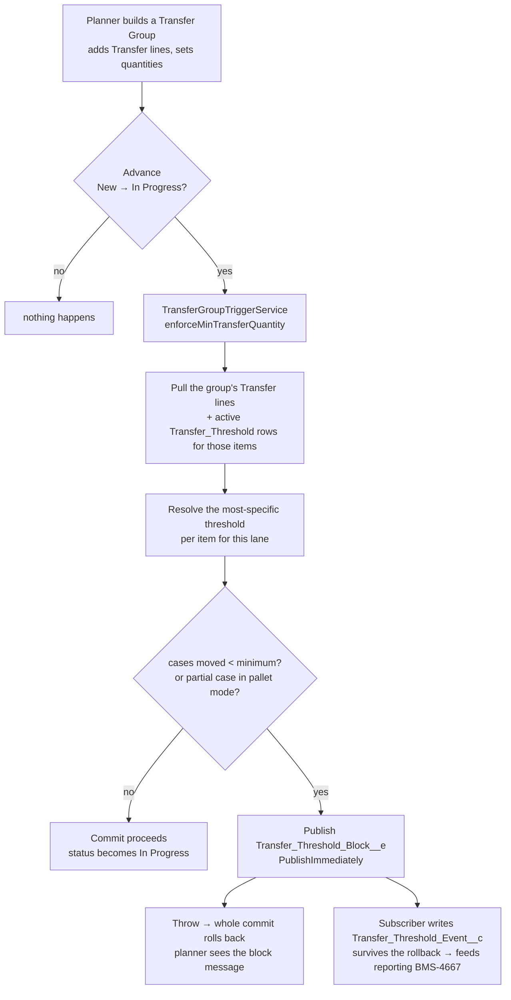
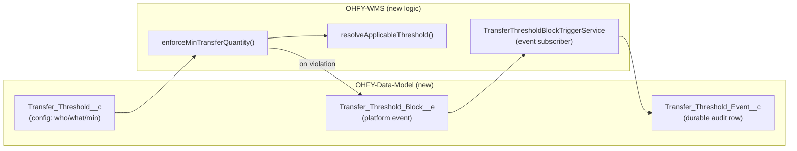

# BMS-4665 — Minimum Transfer Quantity Thresholds

> [!abstract] One sentence
> When a planner commits an inter-warehouse transfer (advancing it **New → In Progress**), if any item on it moves **less than the configured minimum** for that lane — where the minimum can be expressed in **cases, layers, or pallets** — the commit is **blocked** with a message naming the item, the minimum, and the shortfall; and a tamper-proof **audit event** is recorded for reporting.

---

## 0. Update — 2026-06-24 (layer/pallet units + multiple enforcement)

> [!success] What changed since the first cut
> The original build expressed the minimum **only in cases** and the pallet/layer rule only blocked *partial cases*. Per product direction (option B), the minimum is now **unit-aware** and rounding enforces true **whole-layer / whole-pallet multiples**. This makes the AC's *"a minimum of 1 full layer"* configurable directly instead of hand-converted to cases.

**Metadata (`Transfer_Threshold__c`):**
- **Renamed** `Min_Case_Quantity__c` → **`Min_Quantity__c`** ("Minimum Quantity"); validation rule renamed to `Min_Quantity_Must_Be_Positive`.
- **Added** `Quantity_Unit__c` — restricted picklist **Cases (default) / Layers / Pallets**.
- `Enforce_Layer_Pallet_Rounding__c` now means "moved cases must be a **whole multiple** of the Quantity Unit," not just "no partial case."

**Enforcement (`TransferGroupTriggerService.enforceMinTransferQuantity`):**
- Reads `Item__r.Cases_Per_Layer__c` / `Cases_Per_Pallet__c` and **converts the minimum to cases** (`Min_Quantity × cases-per-unit`).
- Rounding check enforces whole-layer/whole-pallet multiples (Cases unit → whole cases, preserving prior behavior).
- **Safety:** a Layer/Pallet threshold on an item **missing the conversion factor is skipped, not blocked** (no false blocks on bad config).
- Block message now names the configured min in its unit **and** the case-equivalent; the audit row keeps storing the case-equivalent (clean reporting basis).

**Tests:** `TransferGroupTriggerService_T` now **28 tests, 100% pass, 90% coverage** (added: layer/pallet minimum block & pass, layer-multiple rounding block & pass, missing layer/pallet factor skip, null-cases-as-zero, mixed no-threshold/empty-group). Deployed + verified on org `ohfy-4665`.

**Open (non-blocking for code):** who maintains the `Transfer_Threshold__c` records and via what surface (record page vs guided/LWC) — posted as a question on BMS-4665 (comment #53585) and the discovery-questions doc (reviewer: Dave/Emily). Override remains **hard-block v1** (unchanged).

---

## 1. The whole picture



The clever bit: the enforcement **throws** to block the save, which **rolls back the whole transaction** — so a normal audit-record `insert` would vanish with it. The block is instead published as a **`PublishImmediately` platform event**, which is delivered *outside* the rolling-back transaction; a subscriber then writes the durable `Transfer_Threshold_Event__c` row. This is the same `Log__e` pattern used elsewhere in the repo.

---

## 2. What existed BEFORE (the foundation we built on)

> [!note] None of this is new — BMS-4665 is a delta on top of it.

| Existing piece | What it does | Role here |
|---|---|---|
| `Transfer_Group__c.Status__c` = **New / In Progress / Complete** | The transfer lifecycle. **There is no "Draft"** status. | The commit point we gate is **New → In Progress** |
| `TransferGroupTriggerService` | Already enforces forward-only status moves + an `Is_Picked__c` gate (throws to block) | We **added a new method** here, beside the existing guards |
| `Transfer__c` lines | Hold per-item quantities: `Transfer_Quantity_Cases__c`, plus Case/Unit/Layer/Pallet fields | The **quantity we measure** against the minimum |
| `Transfer_Group__c.Use_Pallets_And_Layers__c` | Flags a group operating in pallet/layer mode | Toggles **whole-case rounding** enforcement |
| `Inventory_Threshold__c` + `SKU_Override__c` | Shipped config objects (Min/Target/Max DOH, item+location grain) | The **design precedent** we mirrored for the new config object |
| `Log__e` platform-event pattern | Audit that survives rollbacks | The **pattern** our block-audit copies |

**What did NOT exist:** any minimum-quantity or rounding enforcement on transfers — this logic was **greenfield**.

---

## 3. What BMS-4665 ADDS (the delta)



**New config object — `Transfer_Threshold__c`** (the "rule" an admin sets):

| Field | Meaning |
|---|---|
| `Item__c` | Which SKU the rule applies to (required) |
| `Origin_Location__c` | Origin warehouse — **blank = any origin** |
| `Destination_Location__c` | Destination warehouse — **blank = any destination** |
| `Min_Quantity__c` | The minimum that must move, in the **Quantity Unit** below |
| `Quantity_Unit__c` | **Cases / Layers / Pallets** — Layers/Pallets convert to cases via the item's `Cases_Per_Layer__c` / `Cases_Per_Pallet__c` |
| `Enforce_Layer_Pallet_Rounding__c` | If true (and group in pallet/layer mode), moved cases must be a **whole multiple** of the Quantity Unit |
| `Is_Active__c` | Only active rules are enforced |

**New audit objects:** `Transfer_Threshold_Block__e` (event) carries `Transfer_Group_Id__c`, `Item_Id__c`, `Configured_Min_Case_Quantity__c`, `Attempted_Case_Quantity__c`, `Shortfall__c`, `Event_Type__c` → subscriber writes the matching `Transfer_Threshold_Event__c` row for reporting.

---

## 4. What data is pulled in (exactly)

When a group advances New → In Progress, the enforcement runs **2 queries** (bulk-safe, no SOQL in loops):

```apex
// 1) The lines on the committing group(s) — incl. the item's unit-conversion factors
Transfer__c: Item__c, Item__r.Name, Item__r.Cases_Per_Layer__c,
             Item__r.Cases_Per_Pallet__c, Transfer_Group__c, Transfer_Quantity_Cases__c
  WHERE Transfer_Group__c IN :committingGroupIds

// 2) Active thresholds for the items on those lines
Transfer_Threshold__c: Item__c, Origin_Location__c, Destination_Location__c,
                       Min_Quantity__c, Quantity_Unit__c, Enforce_Layer_Pallet_Rounding__c
  WHERE Item__c IN :itemIds AND Is_Active__c = true
```

Plus, already on the group records in the trigger: `Origin_Location__c`, `New_Location__c` (the **destination** lookup), `Use_Pallets_And_Layers__c`, `Status__c`, `Name`.

Then in memory: cases are **summed per (group, item)** across all its lines, the **most-specific threshold wins** (exact lane > one-sided > global; ties → strictest minimum), and each item is checked.

---

## 5. Ambiguities — resolved (v1 defaults, pending PO @Elliot Flores)

| Open question | Decision (v1) | Why |
|---|---|---|
| **Threshold grain** — item? item+lane? warehouse? | **Item + lane**, with blank origin/dest = wildcard | Mirrors `Inventory_Threshold__c`; most flexible without extra objects |
| **Minimum unit** — cases? layers? | **Cases / Layers / Pallets** via `Quantity_Unit__c`, converted to cases at runtime | Lets the AC's "1 full layer" be configured directly *(added 2026-06-24)* |
| **Hard block vs. override** | **Hard block, no override path** | Simplest correct v1; override is a deliberate phase-2 add (the AC's "obtain an override" line is deferred) ← *biggest call* |
| **Rounding** | **Whole-layer / whole-pallet multiples** when `Use_Pallets_And_Layers__c` = true | Honors the mode flag; uses item conversion factors *(upgraded 2026-06-24 from whole-case-only)* |
| **Config maintenance** — who/how? | **Open** — posted to BMS-4665 + discovery doc (Dave/Emily) | Backend-only ticket never specified the admin surface |
| **Audit trail** (not in original AC) | Added via platform event → `Transfer_Threshold_Event__c` | Reporting (BMS-4667) needs a source; survives the rollback |

Also fixed a stale **epic** description (it claimed enforcement happens at "draft finalization" — there is no draft state).

---

## 6. Real-world examples

> [!example] Example A — the core block (Gulf, COKE-12PK) — *the AC scenario*
> **Rule:** `Transfer_Threshold` → Item = COKE-12PK, Origin = Milton FL, Destination = Montgomery AL, **Min = 1, Quantity Unit = Layers**, Active. (COKE-12PK has `Cases_Per_Layer__c = 10`, so 1 layer = **10 cases**.)
> **Action:** A planner builds a transfer of **3 loose cases** of COKE-12PK on the Milton→Montgomery lane and clicks advance.
> **Result:** Blocked. *"Transfer Group TG-00123: item COKE-12PK moves 3 case(s) but the minimum is 1 layer(s) (10 case(s)) (short by 7 case(s))."* A `Transfer_Threshold_Event__c` row is recorded (Event_Type = Block, Attempted 3, Min 10, Shortfall 7).

> [!example] Example B — most-specific lane wins
> Two active rules for **Red Bull 250ml**: a **global** rule (origin & dest blank, Min = 12) and a **Mobile AL → Huntsville AL** rule (Min = 30).
> A transfer of **20 cases** on the **Mobile→Huntsville** lane is **blocked** (the lane-specific Min 30 wins, short by 10). The same 20 cases on a *different* lane (e.g. Milton→Mobile) only faces the global Min 12, so it **passes**.

> [!example] Example C — full-layer multiple rounding
> Group is in pallet/layer mode (`Use_Pallets_And_Layers__c = true`); the matched threshold has `Quantity_Unit__c = Layers` and `Enforce_Layer_Pallet_Rounding__c = true` (COKE-12PK = 10 cases/layer). A line resolves to **15 cases**. Even though 15 ≥ the 1-layer minimum, it's **blocked** because it isn't a whole number of layers: *"item COKE-12PK moves 15 case(s) but must move whole layer(s) (multiples of 10 case(s)) in pallet/layer mode."* 20 cases (= 2 layers) would pass.

> [!example] Example D — no rule, no friction
> No active `Transfer_Threshold` exists for an item → that item is **never blocked**. Thresholds are opt-in per SKU/lane, so existing transfer flows are unaffected until Gulf configures rules.

---

## 7. Status & links
- **PR [#355](https://github.com/Ohanafy/OHFY-Split/pull/355)** — all CI green, **not merged** (awaiting PO sign-off on §5). Local branch has the 2026-06-24 layer/pallet work **not yet committed/pushed**.
- Tests: `TransferGroupTriggerService_T` — **28 passing, 90% coverage** on `TransferGroupTriggerService` (verified on `ohfy-4665`).
- Story points suggested: **8**.
- Tracking note: [[BMS-5162 — Minimum Transfer Quantity Thresholds]]
- Org `ohfy-4665` held until merge.
- **Next in epic:** BMS-4666 reporting spike (source = `Transfer_Threshold_Event__c`) → BMS-4667 reporting build.
