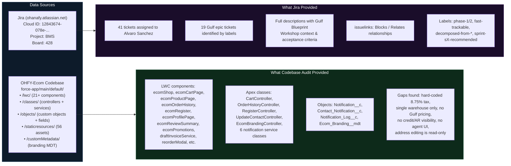

# Gulf Retailer Portal — Flow Diagram

How the Execution Order document was built — the exact sources, queries, and reasoning chain.

---

## Process Trace

How the `00 - Gulf Retailer Portal — Execution Order.md` was assembled.

```mermaid
flowchart TD
    %% ── STEP 1: JIRA QUERY ──
    subgraph S1["Step 1 — Pull All Assigned Tickets"]
        direction TB
        Q1["JQL Query to Jira API<br/><code>project = BMS<br/>AND assignee = 'Alvaro Sanchez'<br/>AND statusCategory != Done<br/>ORDER BY priority ASC, created ASC</code>"]
        R1["Result: 41 open tickets returned<br/>Fields: summary, status, issuetype,<br/>priority, sprint, labels, fixVersions"]
        Q1 --> R1
    end

    %% ── STEP 2: TRIAGE ──
    subgraph S2["Step 2 — Triage & Categorize"]
        direction TB
        SORT["Sort 41 tickets by current state<br/>• 5 In Progress<br/>• 2 In Build<br/>• 2 In Review/Testing<br/>• 7 To Do<br/>• 25 Backlog/Needs Refinement"]
        IDENTIFY["Identify Gulf epic cluster<br/>19 tickets with labels:<br/><code>gulf</code>, <code>ecom</code>, <code>phase-1</code>, <code>phase-2</code><br/>All BMS-3920–3932 + BMS-4049–4054"]
        SORT --> IDENTIFY
    end

    %% ── STEP 3: JIRA DEEP PULL ──
    subgraph S3["Step 3 — Pull Gulf Ticket Details"]
        direction TB
        Q2["JQL Query: 19 Gulf tickets<br/><code>key in (BMS-3920, BMS-3921, ...)</code><br/>Fields: summary, description,<br/>status, priority, labels, issuelinks"]
        R2["Extracted per ticket:<br/>• Full description (story statement,<br/>  Gulf context, acceptance criteria)<br/>• Jira link types (Blocks, Relates)<br/>• Labels (phase-1/2, decomposed,<br/>  fast-trackable, spike-recommended)"]
        Q2 --> R2
    end

    %% ── STEP 4: CODEBASE AUDIT ──
    subgraph S4["Step 4 — Parallel Codebase Audit"]
        direction TB
        AGENT1["Agent 1: Ordering & Cart<br/>Searched force-app/main/default for:<br/>• ecomShop, ecomCartPage, ecomProductPage<br/>• CartController, DraftInvoiceController<br/>• ecomOrderHistory, reorderModal<br/>• Search/filter logic, pricing/promos"]
        AGENT2["Agent 2: Portal & Account<br/>Searched force-app/main/default for:<br/>• Experience Cloud config, branding<br/>• ecomRegister, RegisterController<br/>• ecomProfilePage, UpdateContactController<br/>• Notification classes, Twilio<br/>• Payment/credit components"]
        AGENT1 ~~~ AGENT2
    end

    %% ── STEP 5: CROSS-REFERENCE ──
    subgraph S5["Step 5 — Cross-Reference: Tickets vs Code"]
        direction TB
        MATCH["For each of 19 tickets, matched<br/>Jira requirements against codebase findings<br/><br/>Result per ticket:<br/>• COMPLETE — code exists, Gulf needs config only<br/>• PARTIAL — code exists, needs Gulf extension<br/>• MISSING — net-new build required"]
        STATS["Findings:<br/>~60% of functionality already exists<br/>7 tickets fast-trackable<br/>6 tickets medium (extend existing)<br/>4 tickets large (mostly new code)<br/>2 parent tickets (decomposed, track only)"]
        MATCH --> STATS
    end

    %% ── STEP 6: DEPENDENCY ANALYSIS ──
    subgraph S6["Step 6 — Build Dependency Graph"]
        direction TB
        JIRA_LINKS["Jira issuelinks parsed:<br/>• BMS-3930 marked 'Blocks' 13 tickets<br/>  (flagged as likely misconfigured)<br/>• BMS-3928 relates to 4049/4050/4051/4052<br/>• BMS-3924 relates to 4053/4054<br/>• BMS-3932 blocked by BMS-3930"]
        LOGICAL["Logical dependencies inferred<br/>from codebase (overrides Jira where<br/>Jira links don't make sense):<br/>• Theme before everything (inherits CSS)<br/>• Spike before cart phases<br/>• Catalog before cards before grid<br/>• Cart Ph1 → Ph2 → Ph3 (sequential)<br/>• Checkout before delivery notifications"]
        JIRA_LINKS --> LOGICAL
    end

    %% ── STEP 7: PHASE ASSIGNMENT ──
    subgraph S7["Step 7 — Assign Phases & Order"]
        direction TB
        LABELS["Jira labels informed phasing:<br/>• <code>phase-1</code>: only BMS-3923 (theme)<br/>• <code>spike-recommended</code>: BMS-4049<br/>• <code>fast-trackable</code>: 3921, 3922,<br/>  3929, 3931, 3932<br/>• <code>decomposed-from-*</code>: sub-tickets<br/>• <code>sprint-s2/s3/s4-recommended</code>:<br/>  suggested sprint placement"]
        PHASE["Phase assignment logic:<br/>1. Foundation: phase-1 label + spike + registration<br/>2a. Catalog: data-layer tickets with existing code<br/>2b. Cart: sequential pricing chain<br/>2c. Post-order: depends on checkout<br/>3. Advanced: most net-new, least existing code"]
        LABELS --> PHASE
    end

    %% ── STEP 8: OUTPUT ──
    subgraph S8["Step 8 — Generate Execution Order"]
        direction TB
        OUTPUT["Final document assembled:<br/>• Dependency map (ASCII diagram)<br/>• 5-phase execution table<br/>• Per-ticket: existing code + effort + rationale<br/>• Codebase reality check summary table<br/>• Key insight: ~60% already built"]
    end

    %% ── FLOW ──
    S1 --> S2 --> S3
    S3 --> S4
    S4 --> S5
    S3 --> S6
    S5 --> S7
    S6 --> S7
    S7 --> S8

    %% Styling
    style S1 fill:#0d1b2a,color:#fff,stroke:#1b3a5c
    style S2 fill:#1a0d2a,color:#fff,stroke:#3a1b5c
    style S3 fill:#0d1b2a,color:#fff,stroke:#1b3a5c
    style S4 fill:#0d2a1a,color:#fff,stroke:#1b5c3a
    style S5 fill:#2a1a0d,color:#fff,stroke:#5c3a1b
    style S6 fill:#2a1a0d,color:#fff,stroke:#5c3a1b
    style S7 fill:#1a0d2a,color:#fff,stroke:#3a1b5c
    style S8 fill:#1a3a1a,color:#fff,stroke:#2a5c2a
```

---

## Data Sources Used

Exact inputs that fed the execution order.

---

## Reasoning Chain

How each decision in the execution order was made.

```mermaid
flowchart TD
    %% Phase 1 reasoning
    subgraph R1["Why Phase 1 is Foundation"]
        direction TB
        R1A["BMS-3923 is the ONLY ticket<br/>labeled <code>phase-1</code> in Jira"]
        R1B["Every LWC inherits theme CSS —<br/>building without it means rework"]
        R1C["BMS-4049 labeled <code>spike-recommended</code><br/>— cart phases can't start without<br/>knowing the pricing engine contract"]
        R1D["BMS-3926 registration: codebase audit<br/>found ecomRegister + RegisterController<br/>are COMPLETE — fast win, labeled<br/><code>fast-trackable</code>"]
        R1A --> R1B --> R1C --> R1D
    end

    %% Phase 2a reasoning
    subgraph R2["Why Phase 2a is Catalog"]
        direction TB
        R2A["Codebase audit: ecomShop, ecomProductPage,<br/>search/filtering, CartController all COMPLETE"]
        R2B["These tickets need extension, not rebuild<br/>— highest code reuse = fastest delivery"]
        R2C["Catalog data must exist before<br/>product cards can display it"]
        R2D["BMS-3929 labeled <code>fast-trackable</code><br/>— ecomOrderHistory + reorderModal<br/>fully built, just add 1-click shortcut"]
        R2A --> R2B --> R2C --> R2D
    end

    %% Phase 2b reasoning
    subgraph R3["Why Phase 2b is Cart"]
        direction TB
        R3A["BMS-3928 decomposed into spike + 3 phases<br/>— sequential chain: Ph1 → Ph2 → Ph3"]
        R3B["Jira labels: <code>decomposed-from-BMS-3928</code><br/>+ Relates links confirm the chain"]
        R3C["Spike (4049) in Phase 1 feeds Phase 2b<br/>— defines pricing contract for 4050"]
        R3D["BMS-3921 notifications: audit found<br/>entire framework exists (6 Apex classes,<br/>3 custom objects, Twilio integration)<br/>— just needs Gulf templates, can parallel"]
        R3A --> R3B --> R3C --> R3D
    end

    %% Phase 3 reasoning
    subgraph R4["Why Phase 3 is Advanced"]
        direction TB
        R4A["Codebase audit: Call Center (3922)<br/>and Credit/AR (3930) have the LEAST<br/>existing code — mostly net-new"]
        R4B["BMS-3930 status is 'Needs Refinement'<br/>— not ready to build yet"]
        R4C["BMS-3930 Jira links 'Blocks' 13 tickets<br/>— flagged as likely misconfigured<br/>(credit terms don't logically block<br/>search, notifications, or registration)"]
        R4D["BMS-3920 is an umbrella ticket<br/>— capstone integration test,<br/>not implementation work"]
        R4A --> R4B --> R4C --> R4D
    end

    R1 --> R2 --> R3 --> R4

    style R1 fill:#0d1b2a,color:#fff,stroke:#1b3a5c
    style R2 fill:#1a0d2a,color:#fff,stroke:#3a1b5c
    style R3 fill:#0d2a1a,color:#fff,stroke:#1b5c3a
    style R4 fill:#2a0d0d,color:#fff,stroke:#5c1b1b
```

---

## Summary: Inputs to Output

| Step | Action | Source | What It Produced |
|------|--------|--------|------------------|
| 1 | JQL query: all tickets assigned to Alvaro | Jira API (`searchJiraIssuesUsingJql`) | 41 open tickets with metadata |
| 2 | Triage by status + labels | Step 1 output | Identified 19 Gulf epic tickets by `gulf`/`ecom` labels |
| 3 | JQL query: 19 Gulf tickets with descriptions + links | Jira API | Full story statements, Gulf context, issuelinks, labels |
| 4a | Codebase agent: ordering, cart, search, catalog | `force-app/main/default/lwc/` + `/classes/experienceSite/` | Component inventory, method names, what's COMPLETE |
| 4b | Codebase agent: portal, account, notifications, branding | `force-app/main/default/classes/notifications/` + `/objects/` + `/lwc/` | Notification framework map, registration status, gaps |
| 5 | Cross-reference tickets vs code | Steps 3 + 4 | Per-ticket: COMPLETE / PARTIAL / MISSING assessment |
| 6 | Parse Jira issuelinks + infer logical deps from code | Step 3 links + Step 4 code structure | Dependency graph (flagged BMS-3930 links as suspect) |
| 7 | Phase assignment from labels + dependencies + effort | Steps 5 + 6 + Jira labels (`phase-1`, `fast-trackable`, `sprint-sX-recommended`) | 5-phase execution order with rationale |
| 8 | Generate execution order document | All steps | `00 - Gulf Retailer Portal — Execution Order.md` |
