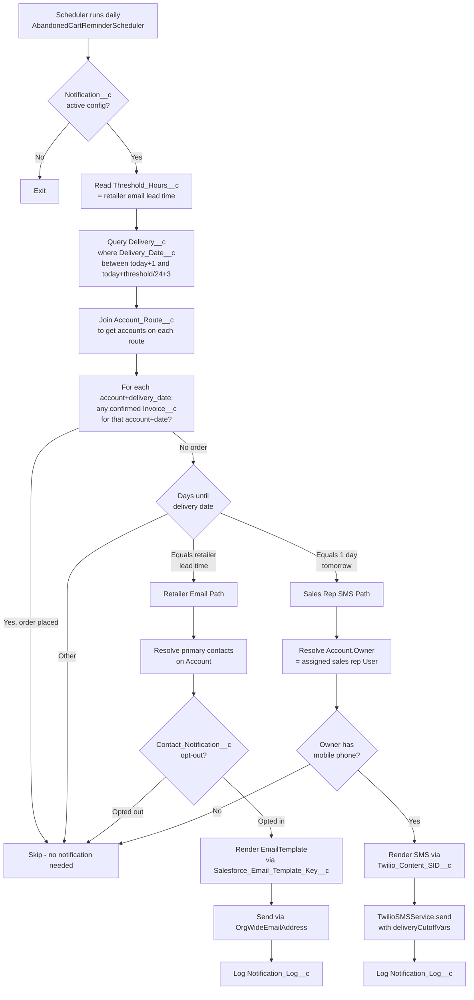

# BMS-XXXX: Automated Order Reminders: Email Retailer + SMS Sales Rep Pre-Delivery |ECOM|

## Related
- Testing: [[BMS-XXXX]] (in Testing/)
- Docs: [[BMS-XXXX]] (in Documentation/)

---

**Priority**: High
**Effort**: M
**Components**: `AbandonedCartReminderScheduler`, `AbandonedCartReminderBatch`, `TwilioSMSService`, `Notification__c` (config), `Contact_Notification__c` (opt-out), `Delivery__c`, `Account_Route__c`, `Invoice__c`

## Story Statement

As a **Sales Rep**, I want to be **automatically notified by SMS the day before a scheduled delivery when one of my assigned retailers has not yet placed an order**, so that I can **proactively reach out before the delivery cutoff and recover the order rather than discovering the miss after the route runs**.

As a **Retailer**, I want to **receive an email reminder ahead of my scheduled delivery date if I have not yet placed an order**, so that I **don't accidentally skip an expected delivery**.

## Scope

**V1 (this story)**
- Daily scheduled job evaluates upcoming deliveries on `Delivery__c`.
- **Email to retailer contacts** when a confirmed order has not been placed for an upcoming delivery, sent N days (admin-configurable) before delivery date.
- **SMS to assigned sales rep (Account Owner)** when a confirmed order has not been placed and delivery is tomorrow.
- Both notifications skipped if a confirmed order already exists for that account + delivery date.
- Contact-level opt-out honored for retailer email; STOP keyword honored for sales rep SMS (Twilio default behavior).
- Admin can configure lead-time window via `Notification__c.Threshold_Hours__c` (existing pattern).

**Out of scope (Phase 2)**
- Smart cadence/frequency-aware triggers (firing based on retailer's historical ordering pattern instead of `Delivery__c` schedule).
- Per-rep customization of SMS lead time.
- Escalation logic (e.g., 2nd reminder, manager CC).
- In-app / push notifications.

## Trigger & Notification Flow

## Acceptance Criteria

### SCENARIO: Retailer receives email reminder ahead of scheduled delivery
**GIVEN** an active `Notification__c` config exists for order reminders with a configured retailer lead-time threshold
**AND** an account has a `Delivery__c` record with `Delivery_Date__c` matching today + retailer lead time
**AND** no confirmed order (`Invoice__c`) exists for that account and that delivery date
**AND** the account's primary email contact has not opted out
**WHEN** the daily scheduled job runs
**THEN** the retailer contact receives the configured email template
**AND** a `Notification_Log__c` row is written referencing the contact, account, and delivery date

### SCENARIO: Sales rep receives SMS the day before delivery when retailer has not ordered
**GIVEN** an account has a `Delivery__c` record with `Delivery_Date__c` = tomorrow
**AND** no confirmed order exists for that account and that delivery date
**AND** the account's owner is a User with a valid mobile phone number
**WHEN** the daily scheduled job runs
**THEN** the assigned sales rep receives an SMS via Twilio with the account name and delivery date
**AND** a `Notification_Log__c` row is written referencing the rep, account, and delivery date

### SCENARIO: No reminder sent when retailer has already placed an order
**GIVEN** an account has a `Delivery__c` for an upcoming date
**AND** a confirmed `Invoice__c` order exists for that account and delivery date
**WHEN** the daily scheduled job runs
**THEN** no email is sent to the retailer
**AND** no SMS is sent to the sales rep
**AND** no `Notification_Log__c` row is written for that account+date

### SCENARIO: Retailer email is suppressed when contact has opted out
**GIVEN** a retailer contact has a `Contact_Notification__c` opt-out row for the order-reminder notification
**WHEN** the conditions for a retailer reminder email otherwise match
**THEN** no email is sent to that contact
**AND** if there are other non-opted-out contacts on the account, those still receive the email

### SCENARIO: Sales rep SMS is suppressed when rep has replied STOP
**GIVEN** the account owner has previously replied STOP to a Twilio SMS from this sender
**WHEN** the conditions for a sales rep SMS otherwise match
**THEN** Twilio suppresses delivery (per platform behavior)
**AND** the suppression is reflected in the `Notification_Log__c` status (failure / opt-out)

### SCENARIO: Reminder is not sent twice for the same account + delivery
**GIVEN** an order-reminder email or SMS has already been sent for an account + delivery date combination
**WHEN** the daily scheduled job runs again before that delivery date
**THEN** the same notification is not re-sent for the same account + delivery date

### SCENARIO: Admin reconfigures lead-time window
**GIVEN** an admin updates `Notification__c.Threshold_Hours__c` for the order-reminder config
**WHEN** the next scheduled run executes
**THEN** the retailer email lead-time uses the new threshold
**AND** no code change or redeploy is required

### SCENARIO: Account has no owner / owner has no phone
**GIVEN** an account is missing an owner, or the owner User has no mobile phone populated
**WHEN** the conditions for a sales rep SMS otherwise match
**THEN** the SMS is skipped gracefully (not retried, not erroring the batch)
**AND** the skip is logged for audit (debug log or `Notification_Log__c` with skipped status)

### SCENARIO: Multiple deliveries on the same day for the same account
**GIVEN** an account has multiple `Delivery__c` records for the same date (e.g., split routes)
**WHEN** the daily scheduled job runs
**THEN** at most one email + one SMS is sent per account per delivery date (deduplication)

## Dependencies
- **Cannot Start Until**: Confirmation from product/operations on V1 lead-time defaults (e.g., 3 days for retailer email, 1 day for sales rep SMS). See Open Questions.
- **This Story Unlocks**: Phase 2 cadence-aware reminders (out of scope here).
- **Ships With**: New `Notification__c` config record(s) (data, deployable as metadata or seeded post-deploy) + new `EmailTemplate` for retailer reminder + new Twilio Content Template for sales rep SMS.

## Open Questions

1. **Source of "next delivery date"** — V1 assumes `Delivery__c` joined via `Account_Route__c` is authoritative (matches the pattern already used in `AbandonedCartReminderScheduler`). Confirm this is the right source for the retailer base — are there retailers without an `Account_Route__c` join who still expect deliveries? If so, V1 will not cover them.
2. **Sales rep identity** — V1 assumes `Account.OwnerId` (User) = the assigned sales rep. Is there a different field (e.g., `Sales_Rep__c` lookup, or a related account team member) that should be used instead?
3. **Sales rep mobile field** — Which User field stores the rep's SMS-capable mobile? `User.MobilePhone`? Or a custom field?
4. **Existing framework reuse vs. new class** — Should this extend `AbandonedCartReminderScheduler` / `AbandonedCartReminderBatch` (which already handle the delivery-date-with-no-order branch for retailer email), or land as a new sibling scheduler/batch (`OrderReminderScheduler` / `OrderReminderBatch`) using the same `TwilioSMSService` + `Notification__c` config? Engineer to decide based on how cleanly the rep-SMS branch grafts onto the existing logic.
5. **V1 lead-time defaults** — Need product to confirm: retailer email = N days before delivery (suggest 2 or 3), sales rep SMS = 1 day before delivery (assumed in this draft).
6. **Cutoff time vs. delivery date** — Does "no order placed" mean (a) no confirmed `Invoice__c` at the time the scheduler runs, or (b) no order placed before the warehouse cutoff time on the prior day? V1 currently models (a). If (b) is needed, the job timing needs to align with cutoff windows per route.
7. **Idempotency mechanism** — Confirm the existing `Notification_Log__c` schema is sufficient to dedupe per account + delivery date + channel, or if a new key is needed.
8. **STOP / opt-out audit** — Do we need a UI for sales reps to opt back in after STOP, or is "rep emails admin to re-enable" acceptable for V1?

## Testing Notes
- **Key fields**: `Notification__c.Threshold_Hours__c`, `Notification__c.Is_Active__c`, `Notification__c.Salesforce_Email_Template_Key__c`, `Notification__c.Twilio_Content_SID__c`, `Notification__c.Supports_Email__c`, `Notification__c.Supports_SMS__c`, `Delivery__c.Delivery_Date__c`, `Delivery__c.Is_Locked__c`, `Account_Route__c.Route__c`/`Account_Route__c.Account__c`, `Invoice__c.Customer__c`, `Account.OwnerId`, `User.MobilePhone`, `Contact_Notification__c` opt-out rows.
- **Edge cases**: account with no owner; owner with no mobile; account with multiple contacts (only non-opted-out ones get emailed); account with multiple deliveries same day; delivery for an account that has placed a *draft* invoice but not confirmed it (should still notify — only confirmed invoices count); time-zone correctness when comparing "tomorrow" against `Delivery_Date__c`.
- **Error states**: Twilio API failure, EmailTemplate missing, OrgWideEmailAddress not configured, batch governor limits with high-volume delivery days.
- **Flows to verify**: scheduler → batch → email send → log; scheduler → batch → SMS send → log; idempotency on consecutive daily runs; opt-out suppression; STOP suppression.

## Implementation Notes
- **Reuse existing framework** — The codebase already has `AbandonedCartReminderScheduler` + `AbandonedCartReminderBatch` + `TwilioSMSService` + `Notification__c` + `Contact_Notification__c` + `Notification_Log__c`. The retailer-email-on-upcoming-delivery branch is already largely implemented in `AbandonedCartReminderScheduler` (queries `Delivery__c`, joins `Account_Route__c`, excludes accounts with confirmed `Invoice__c`). Engineer should evaluate whether the V1 work is:
  - **Option A**: extend the existing scheduler/batch with a sales-rep-SMS branch keyed off `Account.OwnerId`, OR
  - **Option B**: introduce a parallel `OrderReminderScheduler` / `OrderReminderBatch` to keep "abandoned cart" semantics distinct from "no cart at all" semantics. (Recommended if the abandoned-cart job is intended specifically for accounts with a stale draft cart, vs. accounts that never started one.)
- **`TwilioSMSService.deliveryCutoffVars(accountName, firstName, delivDate, cutoffTime)`** is already defined and used. New SMS template would render the same/similar variable set.
- **`Notification__c.Developer_Key__c`** convention — existing scheduler reads `'ABANDONED_CART_REMINDER'`. New config record(s) needed for this feature, e.g. `'RETAILER_ORDER_REMINDER'` and `'SALES_REP_DELIVERY_SMS'`, OR a single combined record with both `Supports_Email__c` and `Supports_SMS__c` true.
- **`Notification_Log__c`** — used to persist sent records; need to confirm fields support per-channel + per-recipient dedupe (account + delivery date + channel + recipient).
- **Idempotency**: scheduler should not re-fire for the same `(account, delivery_date, channel)` triple. Existing `Notification_Log__c` query in `AbandonedCartReminderScheduler` shows the pattern.
- **Test class** must mock Twilio HTTP callouts via `HttpCalloutMock` (existing `TwilioSMSService_T.cls` is the reference). Use `Test.setCreatedDate` or a clock-injection pattern to simulate "tomorrow" reliably across run dates.
- **Hardcoded values to flag**: lead-time defaults (must come from `Notification__c` config, not constants); time-zone basis for "tomorrow" (org timezone vs. account timezone).
