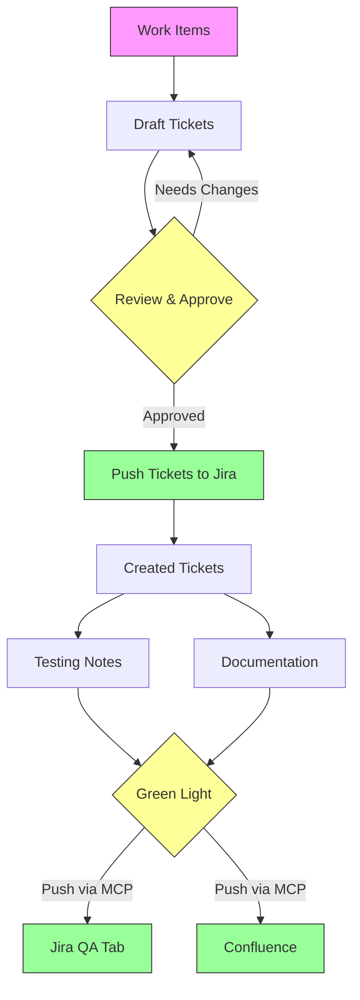

# Anvil Workflow

## What This Solves

**Problem:** Work items went straight to Jira unstructured — no review, no consistency, no documentation trail.

**Solution:** A structured funnel where everything is drafted, reviewed, and approved in Obsidian before touching Jira/Confluence. The MCP tools are the bridge — they only fire after green light.

## The Funnel

| Stage                 | Where                      | What Happens                                   |
| --------------------- | -------------------------- | ---------------------------------------------- |
| **Input**             | Slack, meetings, feedback  | Raw work items collected                       |
| **Draft**             | `Tickets/Drafts/`          | Ticket written with story, AC, dependencies    |
| **Review**            | Obsidian                   | Engineer reviews, adjusts, approves            |
| **Push Tickets**      | MCP → Jira                 | Tickets created in Jira, get BMS numbers       |
| **Create**            | `Tickets/Created Tickets/` | Renamed with BMS number, Jira link added       |
| **Testing**           | `Testing Notes/`           | QA notes written referencing BMS tickets       |
| **Documentation**     | `Documentation/`           | Feature doc updated with BMS ticket references |
| **Push Notes & Docs** | MCP → Jira/Confluence      | QA tab + release notes pushed                  |

## Key Rules

1. **Nothing goes to Jira raw** — always draft in Obsidian first
2. **Tickets are per-work-item** — one `.md` per ticket
3. **Documentation is per-feature** — one `.md` per Experience Cloud page, tickets accumulate via changelog
4. **Green light required** — MCP push only after explicit approval
