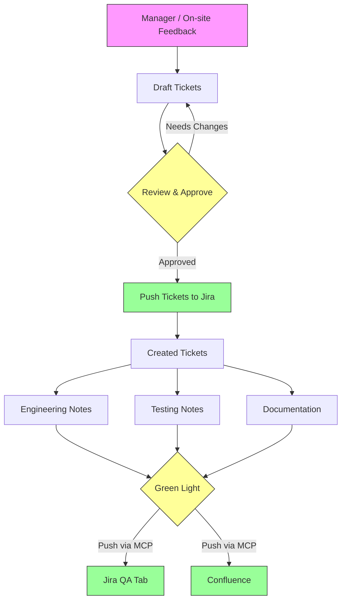

# Anvil Workflow

## What This Solves

**Problem:** Work items went straight to Jira unstructured — no review, no consistency, no documentation trail.

**Solution:** A structured funnel where everything is drafted, reviewed, and approved in Obsidian before touching Jira/Confluence. The MCP tools are the bridge — they only fire after green light.

## The Funnel

| Stage                 | Where                       | Driver                                     | What Happens                                       |
| --------------------- | --------------------------- | ------------------------------------------ | -------------------------------------------------- |
| **Intake**            | `Manager/On-site Feedback/` | manual                                     | Raw stakeholder asks captured before ticketing     |
| **Draft**             | `Tickets/Drafts/`           | `/ticket-create`                           | Ticket written with story, AC, dependencies        |
| **Review**            | Obsidian                    | human                                      | Engineer reviews, adjusts, approves                |
| **Push Tickets**      | MCP → Jira                  | `push it` / `promote`                      | Tickets created in Jira, get BMS numbers           |
| **Create**            | `Tickets/Created Tickets/`  | ticket-create skill                        | Renamed with BMS number, Jira link added           |
| **Engineering**       | `Engineering/`              | `/engineering-notes`                       | Dev notes scaffolded; branch, PR, packages tracked |
| **Testing**           | `Testing Notes/`            | manual (QA)                                | QA notes written referencing BMS tickets           |
| **Documentation**     | `Documentation/`            | manual                                     | Feature doc updated with BMS ticket references     |
| **Push Notes & Docs** | MCP → Jira / Confluence     | manual                                     | QA tab + release notes pushed                      |

## Key Rules

1. **Nothing goes to Jira raw** — always draft in Obsidian first
2. **Tickets are per-work-item** — one `.md` per ticket
3. **Engineering notes mirror the ticket** — one `.md` in `Engineering/` per ticket, kept in sync with branch/PR
4. **Documentation is per-feature** — one `.md` per Experience Cloud page or backend feature; tickets accumulate via the changelog
5. **Green light required** — MCP push only after explicit approval

## Project

All tickets target the `BMS` Jira project (configured in `~/.claude/skills/engineering-notes/config.yml`). Drafts, engineering notes, and testing notes all key off the `BMS-XXXX` number assigned at push time.
