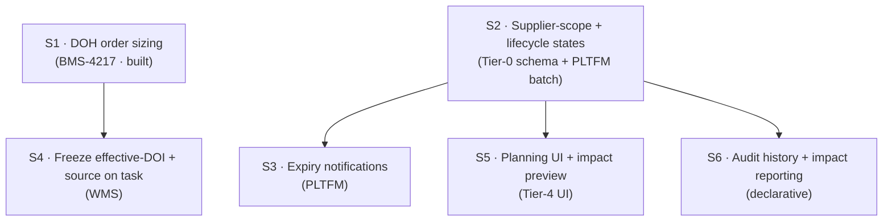

# BMS-5068 — Safety Stock Controls: breakout & overlap mitigation

> [!success] Headline
> Most of BMS-5068's 20-scenario AC (carried on the demo clone **BMS-4217**) is **already delivered** by sibling epics under a DOH-override data model — not a net-new `Safety_Stock_Override__c`. "Safety stock" = a **temporary upward DOH override**, which the shipped `SKU_Override__c` + `Inventory_Threshold__c` + `S_InventoryThresholds` stack already supports. The genuinely net-new, **unowned** work is small and listed below.

## 1. Overlap map — every AC block → owner (code-verified)

Legend: ✅ shipped & in repo · 🟡 partial · ❌ not built

| AC building block | Owning epic / ticket | Code artifact (verified on main) | Status |
|---|---|---|---|
| Supplier + warehouse baseline DOI target | BMS-5113 → **BMS-3822** | `Inventory_Threshold__c` (`Account__c`,`Location__c`,`Min/Target/Max_DOH__c`,`Lead_Time__c`) | ✅ |
| Effective-DOH resolution hierarchy | BMS-5113 → **BMS-3822** | `S_InventoryThresholds.resolve()/resolveAll()` (SKU ovr → suppl@wh → wh → suppl) | ✅ |
| DOI + daily velocity calculation | BMS-5185 → **BMS-3779** | `S_InventoryDOI`, `Inventory__c.Average_Daily_Depletion__c` / `Current_DOI__c` / `Effective_Target_DOH__c` | ✅ |
| SKU-level time-bounded override | BMS-4609 → **BMS-3819** | `SKU_Override__c` (item+loc, Target/Min/Max DOH ovr, Start/End_Date, Status, Override_Reason) | ✅ |
| Override auto-expiry + one-active uniqueness | BMS-4609 | `B_/BA_SKUOverride_ExpirationProcessor` (nightly Active→Expired), `SKUOverrideTriggerService` | ✅ |
| Mandatory override reason | BMS-4609 | `SKU_Override__c.Override_Reason__c` + required-field validation | ✅ |
| Seasonal / date-driven override framing | BMS-5057 | (same `SKU_Override__c` mechanism) | ✅ |
| Replenishment task generation & prioritization | BMS-5174 / BMS-5183 | `E_ReplenishmentTask`, waterfall replenishment | ✅ |
| **DOH-driven order sizing** (target → cases) | **BMS-4217 (this branch)** | `S_ReplenishmentOrderSizing` + `E_ReplenishmentTask.applyDohSizing` (flag-gated) | ✅ built+tested (40/40, 94%/93%) |
| Supplier DOH monitoring / breach alerts | BMS-4933 | (in progress — consumes thresholds) | 🟡 |
| **Supplier-*scope* temporary override** | — none — | `SKU_Override__c` is item+location only; `Inventory_Threshold__c` has no dates/status | ❌ **BMS-5068 owns** |
| **Scheduled + Manually-Closed lifecycle** | — none — | status picklist is Active/Expired/Superseded — no Scheduled, no Manually-Closed/closure audit | ❌ **BMS-5068 owns** |
| **Expiry notifications** (approaching + on-expiry) | — none — | expiration processor flips status but sends no notification | ❌ **BMS-5068 owns** |
| **Freeze effective-DOI + source on the task** | — none — | task stores `Trigger_DOH__c = minDoh` only; no `Resolution_Source__c` | ❌ **BMS-5068 owns** |
| **Planning/management UI + impact preview** | — none — | no override-management LWC | ❌ **BMS-5068 owns** |
| **Override audit history + impact reporting** | — none — | field history only; no dedicated report/dashboard | ❌ **BMS-5068 owns** |
| System-default DOI tier | — (baselines act as default) | resolver returns null → caller defaults | 🟡 optional |

> [!warning] No overlapped mitigation
> BMS-5068 does **not** create a new override object or a parallel threshold mechanism — it **extends** the existing `SKU_Override__c` stack. Rebuilding any ✅ row above would duplicate shipped work under BMS-3822 / BMS-3779 / BMS-3819. **Also confirmed:** no *other* epic owns the ❌ rows (checked BMS-4933, 5060, 5057, 5174, 5185, 5183, 5113, 4542, 4609, 4204).

## Jira (created 2026-07-01)
| Story | Key | Depends on |
|---|---|---|
| S1 · DOH order sizing | **BMS-4217** (re-scope; built) | — |
| S2 · Supplier-scope + lifecycle states | **BMS-5636** | — (schema blocker) |
| S3 · Expiry notifications | **BMS-5638** | S2 |
| S4 · Freeze effective-DOI + source on task | **BMS-5639** | S1 (supplier thread gated on Q4) |
| S5 · Planning UI + impact preview | **BMS-5640** | S2 |
| S6 · Audit history + impact reporting | **BMS-5641** | S2 |

## 2. Decomposition — dependency-ordered stories (net-new only)

**Build order:** S1 (done) ‖ S2 first (schema is the blocker) → then S3, S4, S5, S6 in parallel.

## 3. Polished stories

### S1 — DOH-Driven Replenishment Order Sizing  → **re-scope BMS-4217**
- **What:** target DOH × velocity ÷ units-per-case → round to layer/pallet → clamp to bin capacity; fall back to capacity-fill when unconfigured. Flag-gated (`WMS_Replenishment_DOH_Order_Sizing`, default OFF).
- **State:** built + validated on `feat/safety-stock-doh-sizing-bms-4217` (tests 40/40, coverage 94%/93%, live smoke verified). PR pending.
- **Note:** BMS-4217 is currently a *Demo* clone of BMS-4025; re-scope it to this concrete build (not a re-demo). Small add folded into S4 below (freeze source on task).

### S2 — Supplier-scope safety-stock override + full lifecycle states
- **Extend `SKU_Override__c`** (Tier-0, additive): `Scope__c` (SKU/Supplier), `Account__c` lookup (supplier scope), `Adjustment_Type__c` (Temporary/Permanent), add status values **Scheduled** + **Manually Closed**, `Closed_By__c`/`Closed_At__c`/`Closure_Reason__c`.
- **Extend `S_InventoryThresholds`** to consult active **supplier-scope** overrides (new tier above the supplier baseline).
- **Extend the expiration processor** to also activate **Scheduled → Active** on Effective_From and handle manual-close.
- **Reuse:** existing uniqueness trigger + expiry batch — do not duplicate.

### S3 — Override expiry & approaching-expiry notifications
- In the lifecycle batch: on Active→Expired notify the creator; N-days-before-expiry (default **4**) send an approaching-expiry notification with extend/close-early/allow options. `CustomNotification` + optional email.

### S4 — Freeze effective DOI + resolution source on the task
- Add `Effective_Target_DOH__c` + `Resolution_Source__c` (Standard / SKU Override / Supplier Override / System Default) to `Replenishment_Task__c`; populate at insert in `E_ReplenishmentTask` (today only `Trigger_DOH__c = minDoh`).
- Thread the supplier `accountId` into `resolve()` (today passed `null`). **Gated on the Q4 product call** (pick-face vs inbound PO) — see §5.

### S5 — Safety-stock planning & management UI (Tier-4)
- LWC: list all overrides (scope, target entity, override DOI, standard target, delta, effective dates, status, reason) + filters (status incl. Expiring-Soon, supplier, SKU); create/edit; **impact preview** (SKUs affected, added order qty, est. additional inventory value) reusing `S_ReplenishmentOrderSizing`. `/ohfy-design` + Playwright. Package: **WMS-UI or PLTFM-UI — confirm** (inventory config currently spans PLTFM).

### S6 — Override audit history + impact reporting
- Report type on `SKU_Override__c` (history per SKU: target, dates, reason, created-by, status, closure). Impact report/dashboard on active overrides × est. inventory value (velocity × ΔDOH × case cost). Mostly declarative + one calc field.

## 4. Resolved open questions (best judgment — ratify in refinement)

Labels: **[C]** confirmed-by-code · **[A]** AI-assumed (needs team ratification) · **[O]** open product call

| # | Question | Resolution | Label |
|---|---|---|---|
| 1 | Where is replenishment order qty calculated? | `E_ReplenishmentTask` (pick-face) + `S_ReplenishmentOrderSizing`. No PO-forecasting engine exists. | [C] |
| 2 | Is DOI a concept in Ohanafy? | Yes — `S_InventoryDOI`, `Inventory__c.Current_DOI__c` / `Effective_Target_DOH__c`. | [C] |
| 3 | How is daily velocity computed? | `Inventory__c.Average_Daily_Depletion__c` via `S_InventoryDOI` (BMS-3779). Exact window (7/30d) — confirm with Gulf. | [C]/[A] |
| 4 | POs in Ohanafy or external? DOH sizing where? | POs are in Ohanafy but manual (no forecasting). DOH sizing today = **pick-face replenishment**. v1 = pick-face; inbound-PO sizing deferred. | [O] product call |
| 5 | Category tier in scope? | **Defer** — no `Product_Category` object; supplier+SKU sufficient for v1. | [A] |
| 6 | Approval workflow for large adjustments? | **v1: none.** Add threshold-based approval later if Gulf asks. | [A] |
| 7 | System-default DOI target? | Warehouse/supplier baselines act as defaults today; a single global CMDT default is optional (S6-adjacent), not blocking. | [A] |
| 8 | Impact preview Phase 2 or 3? | **Phase 2**, read-only, reusing the sizing engine (no separate calc). | [A] |
| 9 | Expired override retention? | Keep indefinitely (records are small; audit value). No purge job. | [A] |
| 10 | Supplier communication on buffer orders? | **Out of scope.** | [A] |
| D1 | New `Safety_Stock_Override__c` vs extend `SKU_Override__c`? | **Extend `SKU_Override__c`** — the resolver already consumes it; lower altitude, no duplicate model. | [A] |
| D2 | Supplier-tier activation in replenishment | **Deferred** per prior owner decision ([[BMS-5068-safety-stock-rescope]] Q2); tier exists in code, switch on when Gulf proves need. | [C] confirmed-defer |

## 5. Deferred / needs refinement (not stories yet)
- **Q4 pick-face vs inbound-PO sizing** — genuine product call (see [[BMS-5068-safety-stock-rescope]] brief). Gates S4's supplier-accountId threading.
- **Supplier-tier activation** and **category tier** — deferred v1.
- **Approval workflow** (Q6) — later.

---
Breakout resolved 2026-07-01, code-grounded + 2-agent epic audit. AI-assumed items ([A]) to be ratified in refinement; open product call ([O]) = Q4. Posted to BMS-5068.
