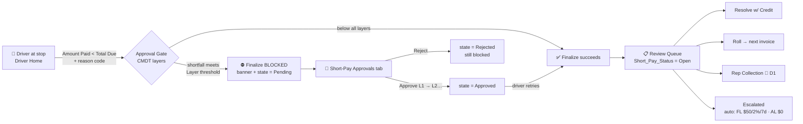
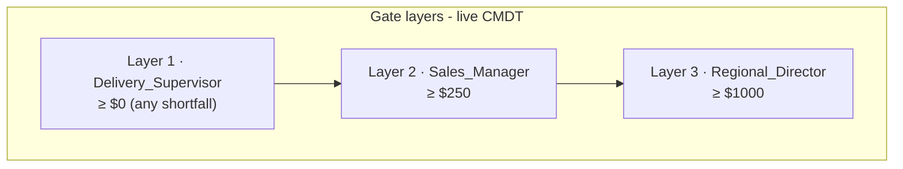
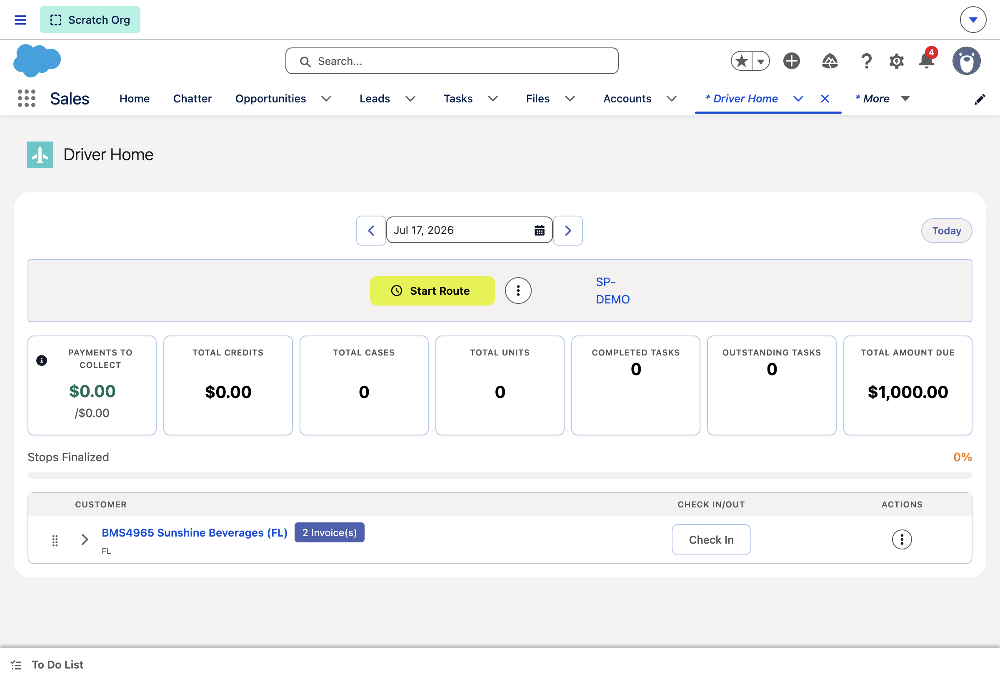
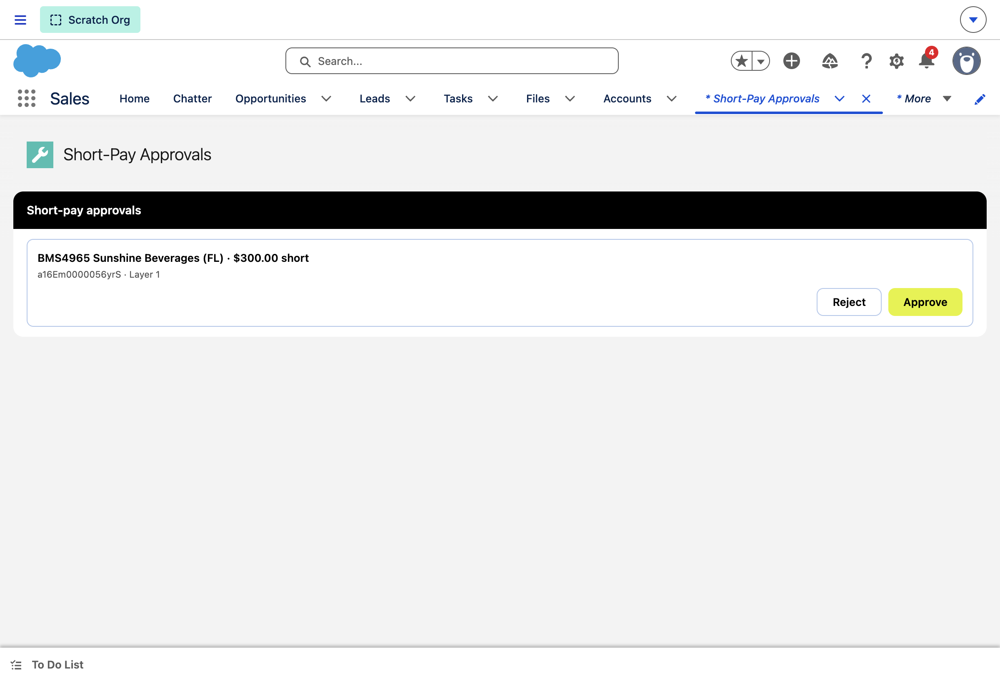
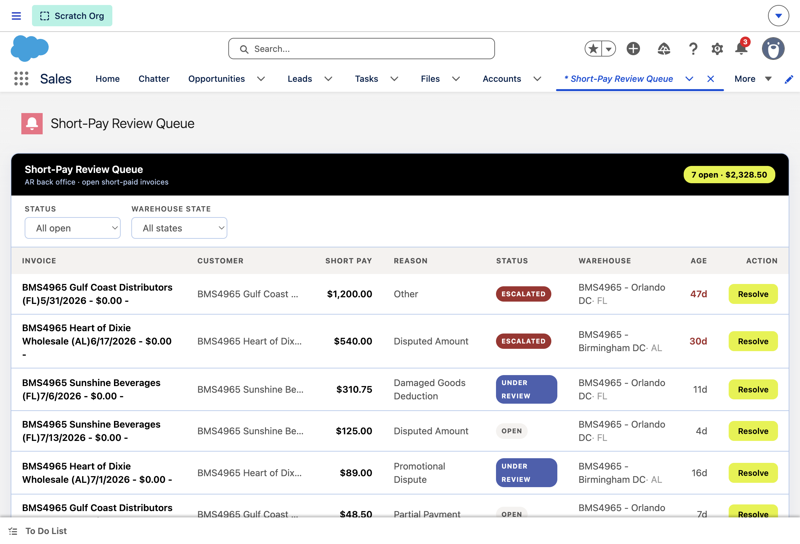

# Short Pay — Dry Run Test Guide

> **Open the org:** `sf org open --target-org ohfy-val-shortPay`
> ⚠️ **Day-rollover:** the driver stop only shows for TODAY. If testing on a later day, re-date first (see [Reseed](#reseed--recovery)).

---

## 1 · The flow you are testing





**Worked examples:** $50 short → L1 only · **$300 short → L1 + L2** (the dry-run case) · $1,500 → L1+L2+L3.

---

## 2 · Where to go + record IDs

### 🔗 Direct URLs (org base: `https://brooklyn-stream-3704-dev-ed.scratch.lightning.force.com`)
| Step | Open this |
|---|---|
| A1 Driver Home | https://brooklyn-stream-3704-dev-ed.scratch.lightning.force.com/lightning/n/ohfy__Driver_Home |
| B5 Approvals (approve L1→L2) | https://brooklyn-stream-3704-dev-ed.scratch.lightning.force.com/lightning/n/ohfy__Short_Pay_Approvals |
| D10 Review Queue | https://brooklyn-stream-3704-dev-ed.scratch.lightning.force.com/lightning/n/ohfy__Short_Pay_Review_Queue |
| A2/B8 DRVDEMO-1 record | https://brooklyn-stream-3704-dev-ed.scratch.lightning.force.com/lightning/r/ohfy__Invoice__c/a16Em0000056yrRIAQ/view |
| C9 DRVDEMO-2 record | https://brooklyn-stream-3704-dev-ed.scratch.lightning.force.com/lightning/r/ohfy__Invoice__c/a16Em0000056yrSIAQ/view |
| D11 SEED-4965-3 (resolve-credit) | https://brooklyn-stream-3704-dev-ed.scratch.lightning.force.com/lightning/r/ohfy__Invoice__c/a16Em0000056ymdIAA/view |
| D12 SEED-4965-2 (roll-forward) | https://brooklyn-stream-3704-dev-ed.scratch.lightning.force.com/lightning/r/ohfy__Invoice__c/a16Em0000056ymcIAA/view |
| D12 roll TARGET (verify $48.50) | https://brooklyn-stream-3704-dev-ed.scratch.lightning.force.com/lightning/r/ohfy__Invoice__c/a16Em0000057fErIAI/view |
| D13 SEED-4965-5 escalated AL | https://brooklyn-stream-3704-dev-ed.scratch.lightning.force.com/lightning/r/ohfy__Invoice__c/a16Em0000056ymfIAA/view |
| D13 SEED-4965-6 escalated FL | https://brooklyn-stream-3704-dev-ed.scratch.lightning.force.com/lightning/r/ohfy__Invoice__c/a16Em0000056ymgIAA/view |
| Today's delivery (SP-DEMO) | https://brooklyn-stream-3704-dev-ed.scratch.lightning.force.com/lightning/r/ohfy__Delivery__c/a0SEm00000AMx0TMAT/view |

*Not logged in? Prefix any path with `sf org open --target-org ohfy-val-shortPay --path "<path after the domain>"` for auto-auth, e.g.:*
```bash
sf org open --target-org ohfy-val-shortPay --path "lightning/n/ohfy__Short_Pay_Approvals"
sf org open --target-org ohfy-val-shortPay --path "lightning/r/ohfy__Invoice__c/a16Em0000056yrRIAQ/view"
```

| Surface                | Tab / URL path                             | What you see (screenshot)                                |
| ---------------------- | ------------------------------------------ | -------------------------------------------------------- |
| Driver Home            | `lightning/n/ohfy__Driver_Home`            |                       |
| Short-Pay Approvals    | `lightning/n/ohfy__Short_Pay_Approvals`    |  |
| Short-Pay Review Queue | `lightning/n/ohfy__Short_Pay_Review_Queue` |              |

### Records (verified live)
| Use | PO / Name | Record Id | State |
|---|---|---|---|
| **Driver test invoice** (main path) | DRVDEMO-1 | `a16Em0000056yrRIAQ` | $500 due / $0 paid / Out For Delivery |
| Driver test invoice #2 (reject path) | DRVDEMO-2 | `a16Em0000056yrSIAQ` | same |
| Today's delivery (route SP-DEMO) | — | `a0SEm00000AMx0TMAT` | driver = your login user |
| Resolve-credit demo row | SEED-4965-3 · $310.75 UR FL | `a16Em0000056ymdIAA` | Sunshine Beverages |
| Roll-forward demo row | SEED-4965-2 · $48.50 Open FL | `a16Em0000056ymcIAA` | Gulf Coast |
| Roll-forward TARGET | QA-4060-ROLL-TARGET | `a16Em0000057fErIAI` | Gulf Coast, open, dated today |
| ⚠️ avoid for resolve-credit | SEED-4965-1 · $125 | `a16Em0000056ymbIAA` | carries leftover QA credit |
| Escalated examples | SEED-4965-5 ($540 AL) / -6 ($1,200 FL) | `…ymfIAA` / `…ymgIAA` | view-only |
| Known-bug row (D1) | SEED-4965-7 · $15.25 | `a16Em0000056ymhIAA` | rep-collect fails here — expected |

Your user is already an **authorized approver for all 3 layers** (permsets `Delivery_Supervisor` / `Sales_Manager` / `Regional_Director`).

---

## 3 · Dry run — click-by-click (~10 min)

### Part A — Driver shorts a payment, gate blocks (BMS-5625)
1. **Driver Home** tab → date shows **today** → stop card *BMS4965 Sunshine Beverages (FL) · 2 Invoice(s)*.
2. Expand the stop (▸ toggle) → open **DRVDEMO-1** ($500 due).
3. **Check In** → then **⋮ More Actions** on the stop row → **✓ Finalize Stop** → the delivered view lists each invoice with its own Payment Method + Amount Paid. On **DRVDEMO-1** type **Amount Paid = `200`** (= $300 short) → pick **Short Pay Reason = `Partial Payment`** → click the **Finalize Stop** button at the bottom. *(Per-invoice payment is native — pay DRVDEMO-2 in full (`500`) or leave it untouched.)*
4. **EXPECT:** ⛔ *"Approval Required"* toast + blocked **Awaiting Approval** banner; the stop does NOT complete. *(AC2)*

### Part B — Manager approves through the chain (BMS-5631)
5. **Short-Pay Approvals** tab → row: *Sunshine Beverages · $300.00 short · Layer 1* (like the screenshot above).
6. Click **Approve** → row advances to **Layer 2** (Sales Manager). *(AC2 sequential)*
7. Click **Approve** again → row clears; state = **Approved**. *(AC3)*
8. Back to **Driver Home** → retry **Finalize** on DRVDEMO-1 → **EXPECT: succeeds**. *(AC4/clear)*

### Part C — Reject path (optional, 1 min)
9. Repeat steps 2–4 on **DRVDEMO-2** (pay `200`) → in **Approvals**, click **Reject** → **EXPECT:** state = Rejected, driver finalize **stays blocked**. *(AC4 reject)*

### Part D — Back-office review queue (BMS-4059/4060)
10. **Short-Pay Review Queue** tab → **EXPECT:** ~7 rows · header totals · STATUS + WAREHOUSE STATE (AL/FL) filters work.
11. On **SEED-4965-3** ($310.75, Under Review) → **Resolve** → *Resolve with Credit* → **EXPECT:** row leaves the open queue, status **Resolved-Credit**, resolved-date stamped.
12. On **SEED-4965-2** ($48.50, Open) → **Resolve** → *Roll to next invoice* → **EXPECT:** status **Rolled-Forward**; target **QA-4060-ROLL-TARGET** now carries the $48.50.
13. View **Escalated** filter → SEED-5 ($540 AL) + SEED-6 ($1,200 FL) — these were auto-escalated by the per-state batch (FL $50/2%/7-day · AL $0).

---

## 4 · Edge cases to be mindful of

| # | Edge case | What happens / what to check |
|---|---|---|
| E1 | **Exact threshold boundary** — pay `250.01` (=$249.99 short) vs `250` (=$250 short) | $249.99 → Layer 1 only; $250 → Layers 1+2. Boundary is **≥** |
| E2 | **Tiny shortfall** — pay `499.99` ($0.01 short) | STILL blocks (Layer 1 = $0 → every short pay gates). This is the current config, not a bug |
| E3 | **Unauthorized approver** | Any user *without* the 3 permsets gets *"Only an approver for this short-pay layer can approve"* — correct AC5 behavior |
| E4 | **Reject → retry** | After a reject, the driver CANNOT finalize; re-shorting the same invoice re-initiates the chain at Layer 1 |
| E5 | 🐛 **Rep Collection (known defect D1)** | *Assign to rep* fails: `FIELD_INTEGRITY_EXCEPTION [WhatId]` — Activities disabled on Invoice__c; status may stick in *Rep Collection* with no Task. **Expected failure**, fix owned by PR #557 |
| E6 | **Day rollover** | Stop vanishes from Driver Home tomorrow — re-date the delivery (below) |
| E7 | **SEED-4965-1** | Carries a leftover QA credit (harmless); don't use it for resolve-credit — totals would confuse |
| E8 | **Overpay / full pay** — pay `500` | No gate, finalizes normally (AC1 baseline) |
| E9 | **Notification bell** | On block you may see *"no resolvable recipients"* logged for notifications — falls back to the queue by design; channel is an OPEN config decision |
| E10 | **EFT path (BMS-5626)** | NOT in this dry run — detection-at-sync is gated on the integration feed. Bank-rec-sourced rows would appear in this same queue once the thin promote-to-Open slice ships |

---

## 5 · Reseed / recovery

```bash
# stop not showing? (day rolled) — re-date delivery + verify
sf apex run --file - --target-org ohfy-val-shortPay <<'EOF'
ohfy__Delivery__c dl = [SELECT Id FROM ohfy__Delivery__c WHERE ohfy__Route__r.ohfy__Route_Number__c = 'SP-DEMO' LIMIT 1];
dl.ohfy__Delivery_Date__c = System.today(); update dl;
System.debug('stops=' + ohfy.E_DriverHome.getTodaysRouteStops(null).size());
EOF

# full queue reseed (idempotent — 7 rows)
sf apex run --file "../seed-data.apex" --target-org ohfy-val-shortPay

# reset a driver invoice after testing (put PO number in)
# Amount_Paid = 0, approval state None, status Out For Delivery
```

**Fixes applied while building this guide** (papertrail): stale `OMS_UI_Wrappers` in-org (source-tracking skip) → force-redeployed with all short-pay wrapper methods; 5631 branch merged into the demo branch (`b947506ea`, pushed); tab visibility granted via permset `PermissionSetTabSetting (DefaultOn)`; SEED-4965-7 reset from stuck *Rep Collection* → *Open*.

---

## 6 · What this dry run proves (AC ↔ step map)
| Step | Ticket / AC |
|---|---|
| A3–A4 banner block | BMS-5625 AC2 (+AC1 baseline via E8) |
| B6–B7 sequential approve | BMS-5631 AC1–AC3 |
| B8 finalize after approve | BMS-5625 AC4 / 5631 AC3 |
| C9 reject stays blocked | BMS-5631 AC4 |
| E3 auth refusal | BMS-5631 AC5 |
| D10 queue + filters | BMS-4060 worklist |
| D11 resolve-credit / D12 roll-forward | BMS-4060 (incl. new on-site AC) |
| D13 escalated rows | BMS-4059 FL/AL thresholds |
| E5 rep-collect failure | Defect D1 → PR #557 |
