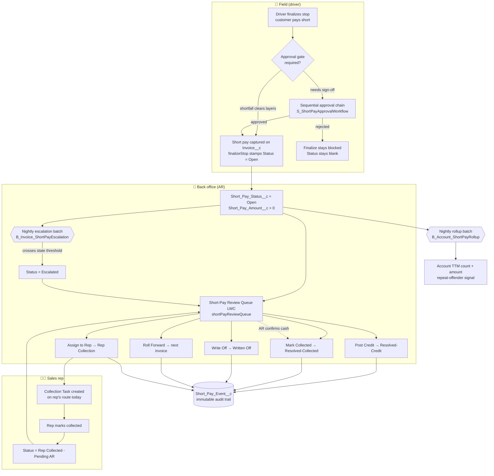
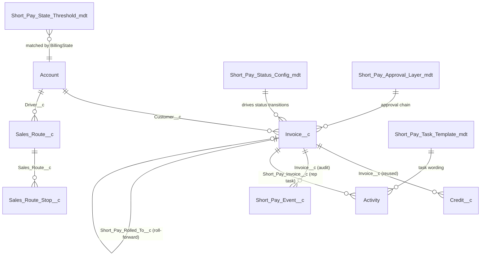
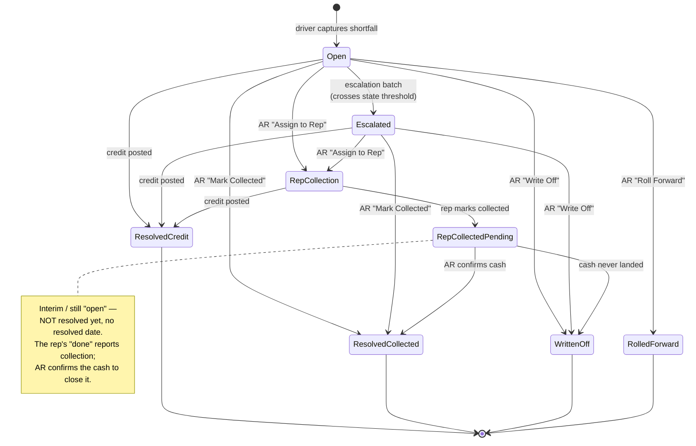
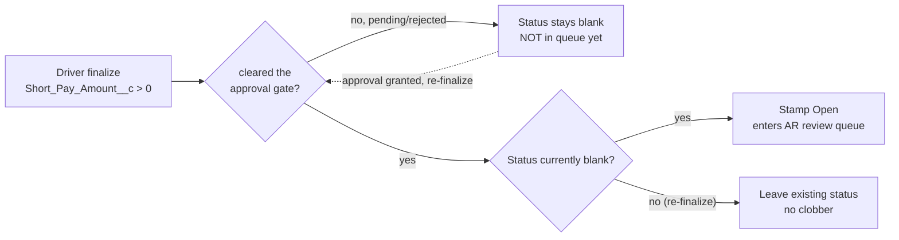
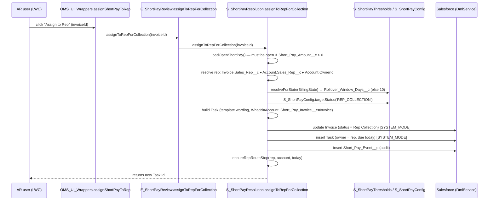
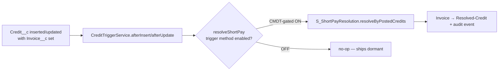

# Short-Pay Automation — Architecture & Data Model (BMS-4965)

> **What this is:** an end-to-end map of how the short-pay feature works — the data model, the state machine, and every automation path — with special focus on **how the AR review queue hands a short pay to a sales rep and creates their collection task.**
>
> **Scope:** epic BMS-4965 (back-office) + BMS-5625 / BMS-4059 / BMS-4060 / BMS-5631 (finalize gate, O-1 thresholds, roll-forward/rep-collection, approval workflow). Packages touched: `OHFY-Data-Model`, `OHFY-OMS`, `OHFY-OMS-UI`.
>
> Field/object API names are shown **unqualified** (`Invoice__c`, `Short_Pay_Amount__c`) as they appear in Apex. In a managed subscriber org they carry the `ohfy__` prefix.

---

## 1. The one-paragraph version

A **short pay** is an invoice the customer paid *less than* what was owed. The driver *captures* the shortfall in the field (that half shipped in BMS-3844). This epic builds the **back-office** half: the shortfall becomes a live number on the invoice (`Short_Pay_Amount__c`), moves through a **status lifecycle** (`Short_Pay_Status__c`), and lands in an **AR review queue**. From that queue AR can resolve it five ways — post a credit, mark it collected, write it off, roll it onto the next invoice, or **hand it to the sales rep for in-field collection** (which creates a due-dated Task on the rep's route). A nightly **escalation batch** auto-flags aging/large shortfalls per state, a **rollup batch** tracks repeat offenders, and every state change writes an immutable **audit event**. A separate **approval gate** can block a driver from finalizing a stop until the right management layer signs off.

---

## 2. Big-picture flow



---

## 3. Data model

**Zero new "short pay" child objects.** Per the rescope decision the feature *extends* `Invoice__c` / `Account` and *reuses* `Credit__c`. The only new objects are one **audit** object and five **config CMDTs**.

### 3.1 Entity map



### 3.2 `Invoice__c` — the short-pay record itself

| Field | Type | Purpose |
|---|---|---|
| `Short_Pay_Amount__c` | Currency **(formula)** | The live shortfall. `Total_Due__c − Amount_Paid__c + Carried_Forward_Short_Pay__c`. **`> 0` means "this is a short pay."** |
| `Short_Pay_Status__c` | Picklist | Lifecycle state (see §4). Open / Under Review / Escalated / Rep Collection / Rep Collected - Pending AR / Resolved-Credit / Resolved-Collected / Written Off / Rolled-Forward. |
| `Short_Pay_Resolved_Date__c` | Date | Stamped **only** on a terminal close (leaves the queue). Interim states never set it. |
| `Carried_Forward_Short_Pay__c` | Currency | A shortfall rolled *in* from a prior invoice (feeds the formula above). |
| `Short_Pay_Rolled_To__c` | Lookup(Invoice__c) | Where a rolled-forward shortfall went. |
| `Short_Pay_Reason__c` / `Short_Pay_Note__c` | Picklist / Text | Driver-captured reason (BMS-3844, pre-existing). |
| `Short_Pay_Approval_State__c` | Picklist | None / Pending / Approved / Rejected — persisted approval-chain state (BMS-5631). |
| `Short_Pay_Approval_Layer__c` | Number | `Sequence__c` of the layer currently awaiting a decision. |
| `Short_Pay_Shortfall_Amount__c` | Currency | The shortfall the approval chain was started for (a larger later shortfall re-runs the chain). |

### 3.3 `Account` — repeat-offender rollups

| Field | Type | Purpose |
|---|---|---|
| `Short_Pay_Count_TTM__c` | Number | # short-paid invoices in trailing 365 days. |
| `Short_Pay_Amount_TTM__c` | Currency | Sum of shortfalls in trailing 365 days. |

Both are maintained by `B_Account_ShortPayRollup` (TTM windows can't be native roll-up summaries). State for threshold matching comes from `Account.BillingState`.

### 3.4 `Short_Pay_Event__c` — immutable audit trail (new object)

One row per meaningful action. Never updated, only inserted; audit failures are logged-and-swallowed so they never block the resolution itself.

| Field | Purpose |
|---|---|
| `Event_Type__c` | e.g. `Resolution`, approval decisions |
| `Action__c` | Human label ("Credit Posted", "Rep Collection", "Written Off") — from `S_ShortPayConfig.auditAction()` |
| `Resulting_Value__c` | The status the invoice moved to |
| `Amount__c` | Shortfall at the time |
| `Actor__c` | `UserInfo.getUserId()` |
| `Invoice__c` / `Layer__c` | The invoice; approval layer where relevant |

### 3.5 `Activity` (Task) — the rep collection task

The rep task reuses the **standard Task** object plus one custom lookup:

| Field | Purpose |
|---|---|
| `Short_Pay_Invoice__c` (on Activity) | Links the collection Task back to the specific short-paid invoice. **Why a custom lookup and not `WhatId`:** `Invoice__c` has activities disabled, so `Task.WhatId` points at the customer **Account**; the invoice link lives here instead. |

### 3.6 Config — Custom Metadata Types (tune without a deploy)

| CMDT | Drives | Key fields |
|---|---|---|
| `Short_Pay_State_Threshold__mdt` | Escalation + roll window, **per state** | `Compliance_State__c` (`*` = wildcard), `Escalation_Amount__c`, `Escalation_Percent__c`, `Aging_Days__c`, `Rollover_Window_Days__c`, `Is_Active__c` |
| `Short_Pay_Status_Config__mdt` | Status **transitions** (key → target status + audit label). Keys: `OPEN` (capture entry), `CREDIT_POSTED`, `MANUAL_COLLECTED`, `ESCALATED`, `WRITTEN_OFF`, `REP_COLLECTION`, `REP_COLLECTED_PENDING` | `Transition_Key__c`, `Target_Status__c`, `Audit_Action__c`, `Is_Active__c` |
| `Short_Pay_Task_Template__mdt` | Rep-task **wording** | `Template_Key__c` (`REP_COLLECTION`), `Subject_Template__c`, `Description_Template__c` (tokens `{customer}` `{amount}` `{invoice}`) |
| `Short_Pay_Approval_Layer__mdt` | Approval **chain** | `Sequence__c`, `Approver_Source__c`, `Threshold_Min__c`, `Threshold_Percent__c`, `Is_Active__c` |

**Seeded values** (⚠️ AI-assumed, pending Gulf/Ops ratification):

- Thresholds — `AL`: $0 / 0 days (escalate everything); `FL`: $50 or 2% of total, 7-day aging, 10-day roll window; `Default (*)`: wildcard fallback.
- Approval layers — L1 `Delivery_Supervisor` (min $0), L2 `Sales_Manager`, L3 `Regional_Director`.

---

## 4. The status lifecycle (state machine)



**Open (resolvable) states** — the ones the review queue shows and automations can still act on:
`Open`, `Escalated`, `Rep Collection`, `Rep Collected - Pending AR`.

**Terminal states** — leave the queue, stamp `Short_Pay_Resolved_Date__c`:
`Resolved-Credit`, `Resolved-Collected`, `Written Off`, `Rolled-Forward`.

Every transition is **data-driven**: `S_ShortPayResolution` never hardcodes a target status — it passes a *transition key* (`OPEN`, `CREDIT_POSTED`, `MANUAL_COLLECTED`, `REP_COLLECTION`, `REP_COLLECTED_PENDING`, `WRITTEN_OFF`, `ESCALATED`) to `S_ShortPayConfig`, which returns both the target picklist value **and** the audit label from one CMDT row (so they can never drift).

### 4.1 The capture → queue hand-off (how a short pay *enters* the queue)

The `[*] → Open` transition above is the join between the driver's world and AR's world, and it's easy to get wrong — the shortfall (`Short_Pay_Amount__c`) is a **formula**, so it becomes positive the moment the driver records a partial payment, but the **queue status is a separate field that must be explicitly stamped**. Nothing else initializes it — there is no field default, no Invoice trigger, no flow.

**`E_DriverHome.finalizeStop` owns this stamp.** When a short pay **clears** finalize (auto-approved below threshold, or the approval chain has approved it), finalize sets `Short_Pay_Status__c = S_ShortPayConfig.targetStatus('OPEN')` (default `Open`). It is guarded twice:

- **only when the invoice actually cleared** — a blocked/pending short pay is *not* in the queue yet, so its status stays blank until the gate clears;
- **only from a blank status** — a re-finalize never clobbers a later queue/resolved state (e.g. an already-`Escalated` or `Resolved-Credit` invoice).

> ⚠️ **Why this matters:** without the stamp, a cleared short pay carries a **blank** `Short_Pay_Status__c` and is invisible to **both** the review queue (`getWorklist` filters `Short_Pay_Status__c IN {Open, …}`) **and** the escalation batch (scans `Open` / `Rep Collection`) — it would silently never reach back office. This hand-off was added in BMS-4965 to close exactly that gap.



---

## 5. ⭐ Deep dive: how "Assign to Rep" creates the collection task

This is the flow you asked about. AR clicks **Assign to Rep** on a row in the review queue; the system moves the invoice to `Rep Collection` and drops a due-dated Task onto that rep's route for today.

### 5.1 The call chain



### 5.2 What the task-creation logic actually does (`S_ShortPayResolution.assignToRepForCollection`)

1. **Guard** — `loadOpenShortPay()` re-queries the invoice and only proceeds if it's still an *open* short pay with `Short_Pay_Amount__c > 0`. A stale/already-resolved invoice throws.
2. **Resolve the rep (3-level fallback):**
   `Invoice.Sales_Rep__c` → else `Account.Sales_Rep__c` → else `Account.OwnerId`. If none → throws "No sales rep found."
3. **Compute the due window** — `S_ShortPayThresholds.resolveForState(Account.BillingState).Rollover_Window_Days__c`, defaulting to **10 days** if the state has no configured window. (Note: this window governs *invoice-side escalation*; the Task itself is due **today** so it's immediately actionable — see #6.)
4. **Move the invoice** — `Short_Pay_Status__c = S_ShortPayConfig.targetStatus('REP_COLLECTION')` (default `Rep Collection`).
5. **Build the Task:**
   - `OwnerId` = resolved rep
   - `WhatId` = **customer Account** (not the invoice — `Invoice__c` has activities disabled, so a Task pointing at it throws `FIELD_INTEGRITY_EXCEPTION`)
   - `Short_Pay_Invoice__c` = the invoice (the real link back)
   - `Subject` / `Description` = rendered from `Short_Pay_Task_Template__mdt` (key `REP_COLLECTION`) with `{customer}` / `{amount}` / `{invoice}` substituted; built-in defaults if no active template row
   - `ActivityDate` = **today**, `Status` = `Not Started`, `Priority` = `High`
6. **Commit** — Invoice update + Task insert via `DmlService` in `SYSTEM_MODE` (back-office automation on system-owned AR data, rule 4).
7. **Audit** — insert a `Short_Pay_Event__c` (`Event_Type__c = Resolution`, `Action__c = Rep Collection`).
8. **Make it visible** — `ensureRepRouteStop()` (see §5.3).
9. **Return** the new Task Id.

### 5.3 Why `ensureRepRouteStop()` exists (the non-obvious part)

Sales Rep Home is a **route-driven** view — it only lists tasks for accounts that are a **stop on the rep's `Sales_Route__c` for the day**. A collection task is not a delivery, so without help it would never appear. `ensureRepRouteStop()` therefore, **idempotently**:

1. Finds the rep's `Sales_Route__c` for today (`Driver__c = rep AND Sales_Route_Date__c = today`); creates one (`"Collections <date>"`) if absent.
2. Adds a `Sales_Route_Stop__c` for the customer account if not already on the route (`Stop_Order__c = 999`, i.e. appended last).

Result: the collection task shows up on the rep's home screen the same day.

### 5.4 Closing the loop

```mermaid
flowchart LR
    A[Rep Collection] -->|rep taps "collected"<br/>markRepCollected| B[Rep Collected - Pending AR]
    B -->|AR confirms cash<br/>markCollected| C[Resolved-Collected ✅]
    B -.->|cash never landed| D[Written Off]
```

The rep marking the task done is **not** the terminal close — it moves the invoice to `Rep Collected - Pending AR` (still open, no resolved date). AR must confirm the cash actually landed (`markCollected` → `Resolved-Collected`) to truly close it. This two-step gate is deliberate: the rep *reports* collection; AR *confirms* it.

---

## 6. The other resolution paths

| Action (queue button) | Method | Transition key | Result | Notes |
|---|---|---|---|---|
| **Post Credit** | `E_ShortPayReview.resolveWithCredit` | `CREDIT_POSTED` | `Resolved-Credit` | Inserts a `Credit__c` (1 case priced at the shortfall, `Reason__c` defaults to *Pricing Issue*). The Credit **after-insert trigger** does the status move (§7). |
| **Mark Collected** | `markCollected` | `MANUAL_COLLECTED` | `Resolved-Collected` | For cash AR recovered directly, **and** the AR confirm step for rep-collected balances. Terminal. |
| **Write Off** | `writeOff` | `WRITTEN_OFF` | `Written Off` | Terminal AR decision — uncollectible. |
| **Roll Forward** | `S_ShortPayResolution.rollToNextInvoice` | — | `Rolled-Forward` | Pushes the shortfall onto the customer's next invoice via `Carried_Forward_Short_Pay__c` + `Short_Pay_Rolled_To__c`. |
| **Assign to Rep** | `assignToRepForCollection` | `REP_COLLECTION` | `Rep Collection` | §5. |

---

## 7. Credit-posted resolution (trigger path)

Resolution-by-credit is **not** called directly by the queue — it rides the existing `Credit__c` trigger so *any* credit posted against a short-paid invoice resolves it (whether from the queue or elsewhere):



- The `resolveShortPay` method is **gated by `Trigger_Configuration__mdt`** (`Resolve_Short_Pay_Credit_AI` / `_AU`), so it ships **dormant** and AR turns it on when ready — no code deploy.
- It's **additive**: bolted onto the existing `CreditTriggerService` without touching the credit logic that was already there.
- Delegated to `S_ShortPayResolution` so the trigger service stays free of the status machine.

---

## 8. The two batch jobs

| Batch | What it does | Scope | Cadence |
|---|---|---|---|
| `B_Invoice_ShortPayEscalation` | Flags `Open` / `Rep Collection` short pays as **Escalated** when the shortfall crosses **any** O-1 cap for the customer's state | Invoices with `Short_Pay_Amount__c > 0` in those states | Scheduled (⚠️ **not yet scheduled** — task 6.4) |
| `B_Account_ShortPayRollup` | Recomputes each account's **TTM count + amount** of short pays (repeat-offender signal) | All Accounts, aggregating invoices in trailing 365 days | Scheduled (⚠️ **not yet scheduled** — task 6.4) |

**Escalation "lower-of" dual cap** (`crossesThreshold`): escalate if shortfall ≥ `Escalation_Amount__c` **OR** shortfall ≥ `Escalation_Percent__c` % of `Total_Due__c` **OR** invoice age ≥ `Aging_Days__c`. A **null** threshold never trips — the safe default for unconfigured states. State-specific row wins over the `*` wildcard.

---

## 9. Approval gate (driver finalize — BMS-5631/5625)

Distinct from resolution. When a driver finalizes a stop with a shortfall, an **approval chain** can block finalize until management signs off.

- **`S_ShortPayApprovalGate`** — *stateless* hard-gate: which layer(s) a given shortfall must clear.
- **`S_ShortPayApprovalWorkflow`** — *stateful* sequential chain persisted on the invoice (`Short_Pay_Approval_State__c` = None/Pending/Approved/Rejected, `Short_Pay_Approval_Layer__c`, `Short_Pay_Shortfall_Amount__c`). Required layers (active `Short_Pay_Approval_Layer__mdt` rows whose `Threshold_Min__c`/`Threshold_Percent__c` the shortfall meets) must approve **in order** by `Sequence__c`.
- **`S_ShortPayApproverResolver`** — resolves the approver for a layer from `Approver_Source__c` (role / permission set / queue).
- **`S_ShortPayApprovalNotifier`** — notifies the current layer's approvers (custom notification type `Short_Pay_Approval_Request`).
- Key rule (`isClearedByState`): an `Approved` state only clears a shortfall **no larger** than the one it was granted for — a bigger shortfall re-runs the chain. `E_DriverHome.finalizeStop` consults this before letting finalize proceed. The **`shortPayApprovals`** LWC is the approver's queue.

---

## 10. Security model

- **`Short Pay Back Office` permission set** — grants AR visibility of the short-pay + AR fields and the review queue. **Drivers do not get it** → drivers *capture* short pays but never *chase* them (they stay blind to AR fields).
- All back-office automation runs `SYSTEM_MODE` (rule 4 — service-account operations on system-owned AR data) with the required rule-citing comments; CMDT reads use `SYSTEM_MODE` rule 1.
- ⚠️ **Task 6.2 (org config, not code):** set driver-profile FLS so short-pay/AR fields are **not readable** to drivers, and assign the permission set to AR users.

---

## 11. Class / component map

| Layer | Component | Responsibility |
|---|---|---|
| **LWC (OMS-UI)** | `shortPayReviewQueue` | AR review queue — worklist, filters, all 5 resolve actions |
| | `shortPayApprovals` | Approver's decision queue (approve/reject) |
| | `driverHomePage` | Driver finalize + short-pay capture + approval status block |
| **Wrapper** | `OMS_UI_Wrappers` (short-pay methods) | `@AuraEnabled` bridge → `E_ShortPayReview` / approval services |
| **Executable** | `E_ShortPayReview` | AR read (`getWorklist`, `getStateOptions`) + resolve delegation |
| | `E_DriverHome` | Driver finalize; consults approval state; **stamps the entry `Open` status on a cleared short pay** (capture→queue hand-off, §4.1) |
| **Service** | `S_ShortPayResolution` | The resolution engine — all status transitions, **rep task creation**, roll-forward, audit |
| | `S_ShortPayConfig` | Transition key → target status + audit label (CMDT) |
| | `S_ShortPayThresholds` | Per-state thresholds + roll window (CMDT) |
| | `S_ShortPayApprovalGate` / `...Workflow` / `...ApproverResolver` / `...Notifier` | Driver-finalize approval chain |
| **Batch** | `B_Invoice_ShortPayEscalation` (+ `S_` schedulable) | Nightly escalation |
| | `B_Account_ShortPayRollup` (+ `S_` schedulable) | Nightly TTM repeat-offender rollup |
| **Trigger** | `CreditTriggerService.resolveShortPay` | Credit-posted → resolution (CMDT-gated, additive) |
| **DTO** | `ShortPayReviewRowDTO` / `DriverFinalizeResultDTO` | LWC-ready carriers |
| **Data-Model** | Invoice/Account fields, `Short_Pay_Event__c`, 4 CMDTs, permission set | §3 |

---

## 12. Outstanding / caveats

- ⚠️ **Threshold & approver CMDT values are AI-assumed** — Gulf/Ops must ratify FL/AL amounts and the L1–L3 approver sources (task 6.3).
- ⚠️ **Batches are not scheduled yet** (task 6.4).
- ⚠️ **Driver FLS + permission-set assignment** is an org-config step (task 6.2).
- ⚠️ **Apex coverage gap:** the review-queue Apex layer (`E_ShortPayReview`, `ShortPayReviewRowDTO`, the new `OMS_UI_Wrappers` short-pay methods) currently has **no Apex test** (0%) — a DoD blocker being addressed.
- The rep task is due **today** (immediately actionable) while the *state roll window* governs invoice-side escalation — a deliberate split, easy to misread.

---

*Sources: `S_ShortPayResolution`, `E_ShortPayReview`, `S_ShortPayConfig`, `S_ShortPayThresholds`, `B_Invoice_ShortPayEscalation`, `B_Account_ShortPayRollup`, `CreditTriggerService`, `S_ShortPayApprovalWorkflow`, data-model fields + CMDT records on branch `demo/short-pay-epic-bms-4965`.*
