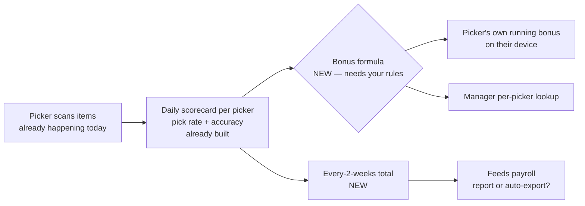

# Picker Incentive Engine — what we need from you

**In plain terms:** we want to show each warehouse picker a live "bonus so far" number on their device — earned by picking fast *and* accurately — and roll those up every two weeks to feed pay. Managers get a per-picker view. A picker can only ever see *their own* number, never a coworker's.

**Good news first:** the hard part is already built. Our warehouse system already tracks every pick (who, how many, how fast, how accurate) and already calculates each picker's daily pick rate and accuracy. So we are **not** starting from scratch and we are **not** blocked waiting on the scan system — it already exists and is running. We can start building the bonus layer now.

## How it fits together (high level)

## The decisions we need

**1. Timing — when does Gulf actually turn this on?**
The scan system this rides on is already live, so *building* the bonus engine isn't blocked. What we need from you is the **rollout call**: do pickers start seeing bonuses at go-live, or do we build it now and switch it on as a fast-follow once the warehouse is comfortable on the new tooling?
→ *We lean: build now, turn on as a fast-follow.* **Your call on timing.**

**2. The bonus rules — what earns how much?**
The system knows each picker's speed and accuracy. It does **not** know your pay policy: e.g., "X cases/hour at 98%+ accuracy = $Y bonus." We'll make this a setting we can tune anytime without a code change, but we need a starting set of rules (or a placeholder for the demo).
→ **We need: the bonus schedule (or a "use this for the demo" placeholder).**

**3. How the money reaches payroll.**
"Biweekly rollups feed pay" — do you want the every-two-weeks bonus total to **auto-export into your payroll system**, or is a **manager-reviewed report** that someone keys in fine for V1?
→ *We lean: manager-reviewed report first, auto-export later.* **Confirm which.**

## What you do NOT need to decide
- **Pay privacy** ("a picker never sees anyone else's pay") — we're guaranteeing this in the software design. It's a rule we enforce in code, not a choice.
- **Whether the data exists** — it does.

## TL;DR — decisions needed
1. **Rollout timing:** at go-live, or fast-follow? (we lean fast-follow)
2. **Bonus rules:** give us the pay schedule / a demo placeholder.
3. **Payroll hand-off:** manager-reviewed report (V1) or auto-export? (we lean report first)
