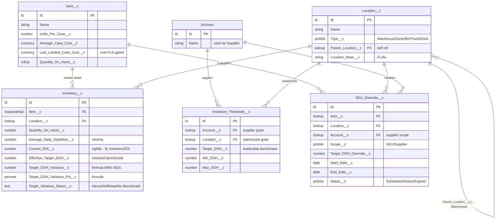

# 🗺️ OHFY — Practical DOH / Safety-Stock data model

> Renders natively in Obsidian (Mermaid, no plugin). The `.dbml` + `.sql` siblings in this folder are for [dbdiagram.io](https://dbdiagram.io) — enable **Settings → Files and links → Detect all file extensions** to see them in the explorer.

**The story:** `B_InventoryDOI` stamps `Current_DOI__c` + `Effective_Target_DOH__c` nightly on each `Inventory__c` (Item × Location). `Effective_Target_DOH__c` is *resolved* by the `S_InventoryThresholds` waterfall — **`SKU_Override__c` → `Inventory_Threshold__c` (supplier+warehouse / warehouse) → Account default**. The BMS-3816 formulas then compare `Current_DOI__c` vs `Effective_Target_DOH__c` → the variance signal.



## Source DBML (paste into dbdiagram.io for the polished view)

```dbml
// see ohfy-doh-safety-stock.dbml in this folder — copy it with:
//   cat Diagrams/ohfy-doh-safety-stock.dbml | pbcopy
// then paste into https://dbdiagram.io
```

_Faithful to OHFY-Data-Model metadata. Curated to the DOH/safety-stock cluster — not every field._
