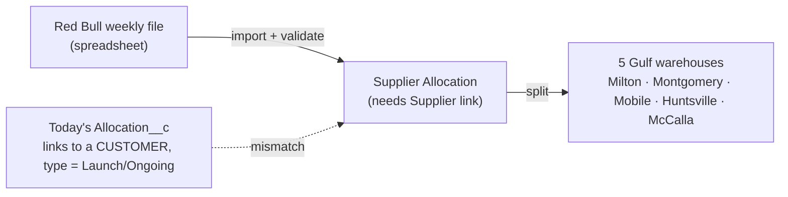

# 🟦 Feedback Needed — Red Bull Allocation Import Automation ([BMS-4935](https://ohanafy.atlassian.net/browse/BMS-4935))

> **In one line:** automate importing Red Bull's weekly allocation files and splitting them across the 5 Gulf warehouses — but the stories assume an allocation model the system doesn't have yet, and none of them have acceptance criteria, so we can't start.

## 📌 Epic at a glance
- **Epic:** BMS-4935 — automatically load Red Bull's weekly allocation spreadsheet, validate it, split it across Gulf's 5 warehouses, and keep an audit trail.
- **Where we are:** **not ready to build.** The three build/spike stories describe the goal but contain no acceptance criteria, and their core assumption — that allocations link to a *supplier* (Red Bull) account — is not how the current allocation object works.
- **What we need from you:** a quick call on the two decisions below. Neither needs a meeting.

## 🖼️ The idea (high level)
_Today's allocation object is built for **customer** allocations. The epic needs a **supplier** allocation. That's the core mismatch._

---

## ❓ Open questions — by ticket
> Plain language. Each ends with the decision we need.

### BMS-4120 / BMS-4121 — the allocation model itself
- **The issue:** The stories say allocations should be "typed (supplier vs. retail)" and "link to the Red Bull supplier account." In the live system, the allocation record is a **customer** allocation — it links to a customer account, and its only types are "Launch" and "Ongoing." There is no supplier link and no supplier type. So the foundation the import is supposed to write into doesn't exist yet.
- **Business impact:** If we guess wrong here, we either overload the existing customer-allocation object (which already drives invoice limits — risky to disturb) or we build the wrong structure and redo it. Either way the import, the warehouse split, and the audit trail all sit on top of this decision.
- **Direction we're leaning:** Create a **separate supplier-allocation object** rather than bending the existing customer one — it keeps today's invoice-limit logic safe and keeps "who we buy from" cleanly separate from "who we sell to."
- **👉 Decision we need from you:** New supplier-allocation object, or extend the existing one? (We recommend new.)

### BMS-4119 / BMS-4120 — the file and the rules (no acceptance criteria yet)
- **The issue:** None of the three stories define what "done" looks like — there's no sample of Red Bull's weekly file, no list of validation rules (which SKUs are valid, what counts as a bad quantity, how duplicates are detected), and no rule for how a total allocation gets split across the 5 warehouses.
- **Business impact:** Without a real file and rules, engineering would be inventing the import contract — almost certain rework once a real Red Bull file shows up, and a real risk of silently importing bad allocation numbers that flow into driver limits and customer orders.
- **Direction we're leaning:** Let the **spike (BMS-4119) actually run first** as a real deliverable — produce a sample file, the validation rules, and the warehouse-split logic — then write acceptance criteria for Phase 1/2 from it.
- **👉 Decision we need from you:** Can you provide (or point us to) a real weekly Red Bull file + the split percentages per warehouse, and confirm the spike runs before Phase 1?

---

## ✅ TL;DR — the decisions, all in one place
1. **BMS-4120/4121:** New supplier-allocation object, or extend the existing customer `Allocation__c`? _(We recommend: new object.)_
2. **BMS-4119/4120:** Provide a real weekly file + warehouse-split rules and run the spike first, so we can write acceptance criteria. _(We recommend: yes.)_

_Comment next to any item, or reply with the numbers + your call. Once answered, this unblocks the build immediately._

---
Internal links: [[BMS-4935-red-bull-allocation-import]] (epic note) · granular questions in `Open-Questions/`. Generated by `/conductor`.
