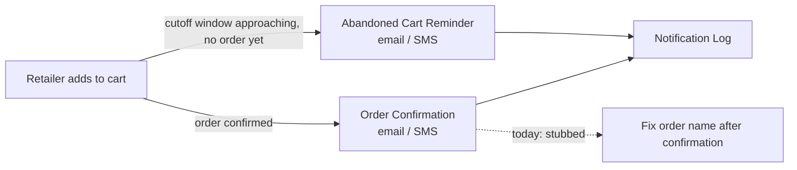

# 🟦 Feedback Needed — Retailer Engagement Notifications ([BMS-4996](https://ohanafy.atlassian.net/browse/BMS-4996))

> **In one line:** This epic sends order confirmations and abandoned-cart reminders to Gulf retailers — and most of it already runs in the codebase today. We need you to confirm what's actually left so we don't rebuild finished work.

## 📌 Epic at a glance
- **Epic:** BMS-4996 — automated email/SMS to retailers: confirm orders, nudge abandoned carts before delivery-route cutoffs, and track order status.
- **Where we are:** the core notification engine is **already built and tested** on the main branch. The remaining children are either done, design/spike artifacts, or not yet detailed enough to build.
- **What we need from you:** one decision (below) on the single buildable story.

## 🖼️ The idea (high level)

The pieces in solid lines already exist and are tested. The dotted "fix order name" step is the only open item — and today it's a placeholder that does nothing.

---

## ❓ Open questions — by ticket
> One block per ticket that has an open question. Plain language. End each with the **decision we need**.

### BMS-4073 — Notification Services: Abandoned Cart Reminder & Order Confirmation
- **The issue:** Everything this ticket describes — order confirmations, split-invoice handling, abandoned-cart reminders, 24-hour de-duplication, skipping accounts that already ordered, batch processing — is **already implemented and tested** in the code. The one exception is the "fix the order name after confirmation" step: the ticket says it rebuilds the order name from the real sales rep, but in the code that function is currently an empty placeholder, deliberately switched off until a related data migration lands.
- **Business impact:** If we treat this as new work, an engineer spends days re-implementing something that already ships — pure waste. If we ignore it, the order-name cleanup stays broken and confirmed orders may show the wrong/masked name.
- **Direction we're leaning:** Close BMS-4073 as already-delivered, and carve the "fix order name" cleanup into its own small ticket that waits on the data migration it depends on.
- **👉 Decision we need from you:** Confirm — is BMS-4073 already satisfied (we close it), or should it be re-scoped to *only* the order-name fix? And if the latter, is the underlying data migration done so we can turn it on?

---

## ✅ TL;DR — the decisions, all in one place
1. **BMS-4073:** Close as already-built, or re-scope to just the order-name fix? (And if re-scoped: is the dependency migration complete?)

_Comment next to the item, or reply with your call. Once answered, this unblocks the build immediately._

---
Internal links: [[BMS-4996-retailer-engagement-notifications]] (epic note) · granular question in `Open-Questions/BMS-4073-order-name-fix-scope`. Generated by Manager auditor DRY-RUN, 2026-06-28.
