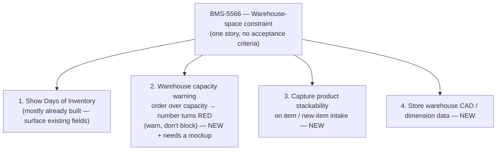

# 🟦 Feedback Needed — Days of Inventory (DOI) ([BMS-5060](https://ohanafy.atlassian.net/browse/BMS-5060))

> **In one line:** This epic gives the warehouse and supply-chain teams a shared view of how many days of stock they have — and the one open story needs to be split before we can build it.

## 📌 Epic at a glance
- **Epic:** BMS-5060 — Days of Inventory: show how long current stock will last, flag when it's too low or too high, and warn when an order won't physically fit the warehouse.
- **Where we are:** The data foundation already exists in the system (DOI fields on Inventory and Account). The discovery spike is done. The only remaining open story is a raw on-site wishlist note that hasn't been refined into buildable pieces.
- **What we need from you:** one decision — how to slice that story and what's in scope for Gulf go-live. Comment inline, no meeting needed.

## 🖼️ The idea (high level)
_The open story really contains four separate ideas. Here's how they relate:_

<!-- Slice 2 (the red capacity warning) is the headline ask and needs a UI mockup before build. -->

---

## ❓ Open questions — by ticket
> One block per ticket that has an open question. Plain language. End each with the **decision we need**.

### BMS-5566 — Forecast: warehouse-space constraint
- **The issue:** This single story actually bundles four different features and has no acceptance criteria, so engineering can't start. Some of it (the Days-of-Inventory math) is already built; the rest (the capacity warning, stackability, warehouse dimensions) is brand new and varies a lot in size and effort.
- **Business impact:** Built as one big lump, it's slow, risky, and hard to parallelize — and the piece the on-site team actually flagged for go-live (the "order won't fit → turn it red" warning) gets stuck behind the parts that aren't go-live-critical.
- **Direction we're leaning:** Split into four stories, add acceptance criteria to each, and for go-live build only (1) surfacing Days of Inventory and (2) the warehouse-capacity red warning. Defer stackability capture and CAD/dimension storage as later (P2/P3). The capacity warning gets its own mockup first since it's the only real new screen.
- **👉 Decision we need from you:** Approve the 4-way split, and confirm go-live scope = slices 1 + 2 only (defer 3 + 4)? Yes / adjust.

---

## ✅ TL;DR — the decisions, all in one place
1. **BMS-5566:** Split the story into 4, add acceptance criteria, and ship only "show DOI" + "capacity red-flag warning" for go-live (defer stackability + CAD)? — yes / adjust.

_Comment next to the item, or reply with the number + your call. Once answered, this unblocks the build immediately._

---
Internal links: [[BMS-5060-days-of-inventory]] (epic note) · granular question in [[BMS-5566-warehouse-space-decompose]]. Generated by `/conductor`.
