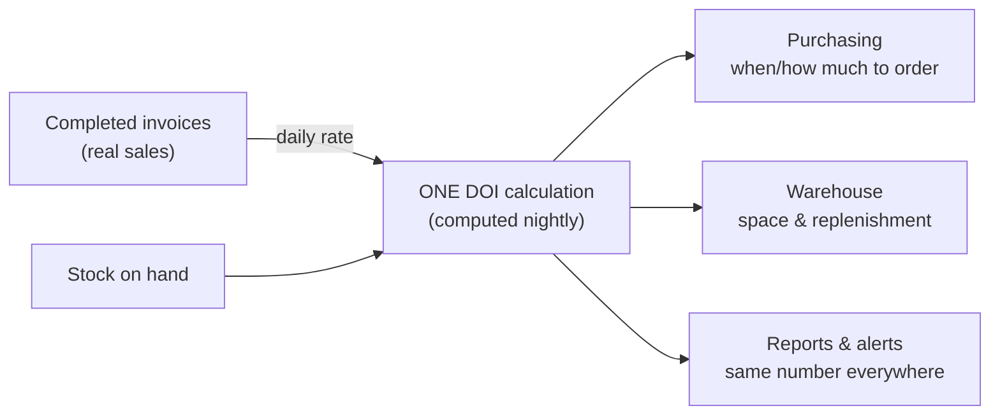

# 🟦 Feedback Needed — DOI Formula Standardization ([BMS-5113](https://ohanafy.atlassian.net/browse/BMS-5113))

> **In one line:** we want *one* "days of inventory" number that every team trusts — and most of it is already built. Three quick calls below settle *how* we compute it, then we finish.

## 📌 Epic at a glance
- **Epic:** BMS-5113 — stop the situation where the same beer looks *overstocked* to purchasing and *critically low* to the warehouse, because each team calculates "days of inventory" differently.
- **Where we are:** the shared calculation is **already running in the product** (built under earlier tickets). We need to align it to the definition Leah captured with the Gulf team, then extend the reports.
- **What we need from you:** a quick call on the 3 items below — no meeting needed.

## 🖼️ The idea (high level)

*Today the calculation uses "how fast stock dropped" as a stand-in for sales. The change below is to use **actual completed sales** instead — because stock also drops for reasons that aren't sales (transfers, shrink), and it wrongly looks slow during out-of-stocks.*

---

## ❓ Open questions — by ticket

### BMS-3742 — What counts as "a sale" in the calculation?
- **The issue:** the live calculation infers demand from stock dropping. That gets distorted by transfers, shrink, and the out-of-stock re-order noise Chandler flagged (*"the rate of sale drops every day… doesn't mean it has a low rate of sale"*).
- **Business impact:** if the source is wrong, the *one number* everyone is supposed to trust is still subtly wrong — buyers over/under-order and the whole standardization loses credibility.
- **Direction we're leaning:** switch to **completed invoiced quantity** (actual sales) — exactly what the discovery notes call for. It changes every DOI number, so we'd reconcile before/after on a test org and show you the shift before it goes live.
- **👉 Decision we need from you:** confirm we standardize on **completed sales (invoiced quantity)** as the demand source. Yes / no.

### BMS-3742 — Do you want 30, 60 and 90-day views?
- **The issue:** today there's a single lookback window. The discovery notes ask for three (30/60/90) so teams pick the lens that fits a SKU.
- **Business impact:** a fast mover and a seasonal slow mover need different windows; one window misleads on one of them.
- **Direction we're leaning:** compute and store all **three** windows now (custom windows like 45 days come later).
- **👉 Decision we need from you:** 30/60/90 all three now — yes, or start with just 30?

### BMS-5113 (whole epic) — One word or two: "DOI" vs "DOH"?
- **The issue:** "Days of Inventory" (purchasing) and "Days on Hand" (warehouse) are the same math at different grains. The notes ask whether to pick one word.
- **Business impact:** two words for one thing keeps the cross-team confusion alive; but renaming what's already built is costly and risky.
- **Direction we're leaning:** **keep both words** with clear, separate meanings — DOH = the *target* a team sets, DOI = the *actual* computed number — which is already how the system is built.
- **👉 Decision we need from you:** OK to keep both terms (target = DOH, actual = DOI)? Yes / no.

---

## ✅ TL;DR — the decisions, all in one place
1. **BMS-3742:** Use **completed sales (invoiced quantity)** as the demand source? *(we recommend yes)*
2. **BMS-3742:** Track **30/60/90-day** windows now? *(we recommend yes)*
3. **BMS-5113:** **Keep both** "DOI" and "DOH" (target vs actual)? *(we recommend yes)*

_Comment next to any item, or reply with the numbers + your call. Once answered, this unblocks the last build (BMS-3742) and the reporting extensions immediately._

---
Internal links: [[BMS-5113-doi-formula-standardization]] (epic note) · granular questions: [[BMS-5113-sales-rate-source]], [[BMS-5113-lookback-windows]], [[BMS-5113-doi-doh-vocabulary]]. Generated by `/conductor`. Not yet published to Jira/Notion — Atlassian access was unavailable this run.
</content>
