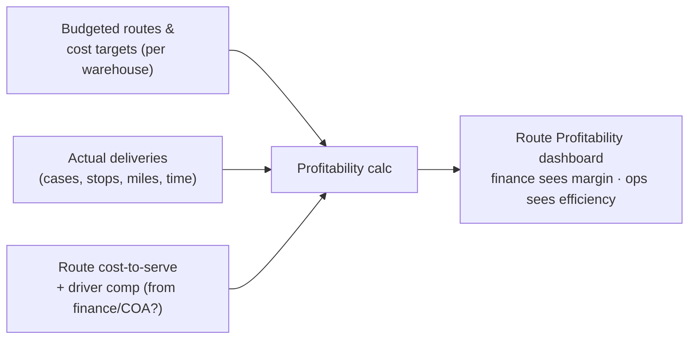

# 🟦 Feedback Needed — Route Profitability Analytics ([BMS-5129](https://ohanafy.atlassian.net/browse/BMS-5129))

> **In one line:** Gulf wants to see which delivery routes make or lose money — but before we can build it we need to know where the money data comes from and whether this is a brand-new screen or an addition to the route screen we already have.

## 📌 Epic at a glance
- **Epic:** BMS-5129 — give operations and finance a view of each route's budget-vs-actual cost, profitability, and truck/headcount efficiency, so they can justify adding, cutting, or consolidating routes with data.
- **Where we are:** **not yet buildable.** The story describes the goal well but has no acceptance criteria, and the underlying cost/budget data doesn't exist in the system yet.
- **What we need from you:** the two calls below. Both are needed before any engineer can start.

## 🖼️ The idea (high level)

The grey box — route cost, driver comp, budget — is the part that doesn't exist anywhere in the system today.

---

## ❓ Open questions — by ticket

### BMS-3853 — Route Profitability Analytics
- **The issue:** To show profit you need cost and budget per route. Today the system stores route *volume* (cases, stops, weight, revenue) but **zero cost, compensation, or budget** data. There's nowhere for it to even live yet.
- **Business impact:** Without a decision on the data source, this is a guess — we'd build a dashboard with no numbers to put in it, or invent a model finance won't trust.
- **Direction we're leaning:** Source cost/comp/budget from the finance/COA work that's already done (BMS-3978) and add a small route-profitability roll-up. Build that data layer as its own story first, then the dashboard.
- **👉 Decision we need from you:** Where do route cost, driver compensation, and budgeted-routes numbers come from — finance/COA, a spreadsheet, or somewhere else — and is it OK to add new fields to capture them?

### BMS-3853 / BMS-5551 — one dashboard or two?
- **The issue:** We already shipped a "Route Optimization Opportunities" dashboard. This profitability ask, plus BMS-5551's "reroute KPI view," would be a second and third route-analytics screen covering overlapping ground.
- **Business impact:** Three separate route-analytics screens means duplicated logic, inconsistent numbers, and confused users.
- **Direction we're leaning:** Treat profitability (3853) and the reroute KPI list (5551) as one workstream and extend the existing analytics foundation rather than fork it.
- **👉 Decision we need from you:** Is Route Profitability a brand-new screen, or an extension of the existing Route Optimization dashboard — and should BMS-5551 be merged into this effort?

---

## ✅ TL;DR — the decisions, all in one place
1. **BMS-3853 (data):** Where do route cost / driver comp / budget come from, and can we add fields to store them?
2. **BMS-3853 + BMS-5551 (surface):** New profitability screen, or extend the existing route dashboard — and fold 5551 in?

_Comment next to any item, or reply with the numbers + your call. Once answered, this unblocks the build immediately._

---
Internal links: [[BMS-5129-route-profitability-analytics]] (epic note) · granular questions in `Open-Questions/`. Generated by `/conductor`.
