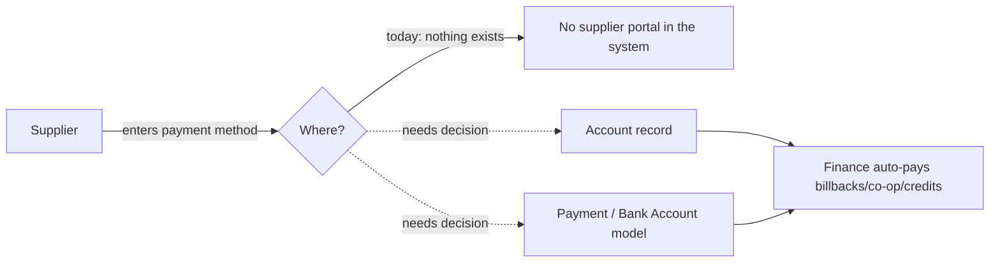

# 🟦 Feedback Needed — Supplier Portal: Payment Method Capture ([BMS-5139](https://ohanafy.atlassian.net/browse/BMS-5139))

> **In one line:** Let Gulf suppliers put a payment method on file so finance can pay billbacks/co-op/promo credits electronically — *but we can't start building because the ticket has no acceptance criteria and the foundational "what does the portal look like" spike hasn't been done yet.*

## 📌 Epic at a glance
- **Epic:** BMS-5139 — capture a supplier's verified payment method so Gulf finance can auto-disburse supplier funding (billbacks, co-op, promotional credits) instead of cutting manual checks.
- **Where we are:** **not ready to build.** The single child story (BMS-3738) describes the *why* well but never says *what to build* — no acceptance criteria — and it depends on an architecture spike that's still in the backlog.
- **What we need from you:** one decision (below) plus a green light to run the spike first.

## 🖼️ The idea (high level)

_Today the only customer-facing portal we have is the eCommerce store. There is no supplier portal, no "supplier" object (suppliers are Accounts), and payments are an internal Account-based module. So "capture in the supplier portal" has no home yet._

---

## ❓ Open questions — by ticket

### BMS-3738 — Supplier Portal: Payment Method Capture
- **The issue:** The story tells us the goal but not the build. There's no acceptance criteria, no chosen place to store the payment method, and — critically — there is no supplier portal in the system today (only the eCommerce store). The related groundwork spike (BMS-4126) that's supposed to decide the portal + data model is still sitting in the backlog.
- **Business impact:** If we guess and build against the wrong model, we're touching Gulf's core financial objects (Accounts, Payments) — high blast radius, likely rework, and risk to live billing. If we wait, supplier auto-payments stay manual a bit longer, but we build it once, correctly.
- **Direction we're leaning:** Run the BMS-4126 architecture spike first to decide *where* payment methods live and *what surface* captures them, then come back and write real acceptance criteria for BMS-3738.
- **👉 Decision we need from you:** Do you want us to (A) **prioritize the BMS-4126 spike now** and hold this story until it lands, or (B) ship a **thin back-office-only slice** — a supplier payment-method field on the Account with no portal — to unblock finance sooner?

---

## ✅ TL;DR — the decisions, all in one place
1. **BMS-3738:** Spike-first (run BMS-4126, hold the story) **or** thin Account-only slice now? — pick one. Either way the story needs real acceptance criteria before an engineer can take it.

_Comment next to the item, or reply A or B. Once decided, this unblocks the build immediately._

---
Internal links: [[BMS-5139-supplier-portal-payment-method-capture]] (epic note) · granular question in `Open-Questions/BMS-3738-payment-capture-target-and-portal`. Generated by `/conductor` (DRY-RUN audit).
