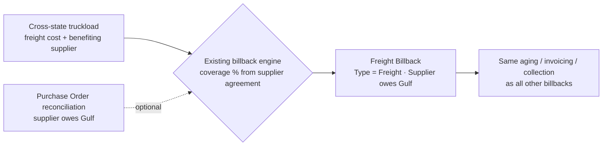

# 🟦 Feedback Needed — Supplier Freight Cost Billbacks ([BMS-5161](https://ohanafy.atlassian.net/browse/BMS-5161))

> **In one line:** when Gulf trucks product across state lines and pays freight that really benefits a supplier, we want to automatically bill that freight back to the supplier — reusing the billback system we already built, not a new one. Two quick boundary calls from you unblock the build.

## 📌 Epic at a glance
- **Epic:** BMS-5161 — recover cross-state freight costs from the supplier who benefits, as a "freight" billback on the existing supplier-billback ledger.
- **Where we are:** the heavy lifting is **already shipped** — the billback ledger, the supplier-owes-us record, coverage-percentage agreements, and the auto-generation engine all exist in code today. Freight just needs to become a new *source* that feeds them. That makes this a much smaller build than the epic originally assumed.
- **What we need from you:** two boundary decisions below (a couple minutes). No new "recovery system" is being built — we're plugging freight into the one you already have.

## 🖼️ The idea (high level)
A cross-state truckload carries a freight cost. We tag which supplier benefits, and the system creates a freight billback (the supplier owes Gulf) — same ledger, same aging, same settlement as every other billback.

---

## ❓ Open questions — by ticket

### BMS-5161 · Story C — PO-side "supplier owes us" billback
- **The issue:** You asked for a Purchase Order "optional billback" for when a *supplier* owes Gulf money. Good news: the ledger already supports "supplier owes us" — no rebuild needed. The only real question is *how far this epic reaches*.
- **Business impact:** If we scope it to freight only, this epic ships fast and stays focused. If we make it the general "any PO dispute → bill the supplier" engine, it grows a lot and starts overlapping the separate Billback Automation work (BMS-4951).
- **Direction we're leaning:** Keep this epic's PO piece to **freight the supplier owes** (e.g., inbound freight). Route the general "any PO variance → billback" engine to the Billback Automation epic.
- **👉 Decision we need from you:** _Freight-only PO billback here, general PO-dispute engine under BMS-4951 — yes?_

### BMS-5161 · Stories B & C — don't double-bill freight vs. damage claims
- **The issue:** We already auto-bill suppliers for carrier **short/damage** on inbound loads (shipped: BMS-5118, BMS-5200). This epic adds **freight cost**. A single cross-state truck could be both short *and* costly to ship — we must not bill the same dollar twice.
- **Business impact:** Double-billing a supplier is a relationship and dispute risk; under-billing leaves money on the table. We want a clear, auditable rule.
- **Direction we're leaning:** Keep them as **different billback types** — "Freight" = transportation cost only; short/damage stays on the existing claims path. Both can legitimately hit the same truck, but they're different dollars. Add an audit report to catch overlaps.
- **👉 Decision we need from you:** _OK to treat freight and short/damage as separate, both-allowed billback types (not block one when the other exists)?_

---

## ✅ TL;DR — the decisions, all in one place
1. **Story C scope:** Freight-only PO billback in this epic; general PO-dispute engine goes to BMS-4951. _Confirm?_
2. **Freight vs. damage:** Separate billback types, both allowed on the same shipment, with an audit report — not a hard block. _Confirm?_

_Comment next to any item or reply with 1/2 + your call. Once answered, the build starts immediately._

---
Internal links: [[BMS-5161-supplier-freight-cost-billbacks]] (epic note) · [[BMS-5161-po-side-billback-scope]] · [[BMS-5161-freight-claims-boundary]]. Generated by `/conductor`.
</content>
