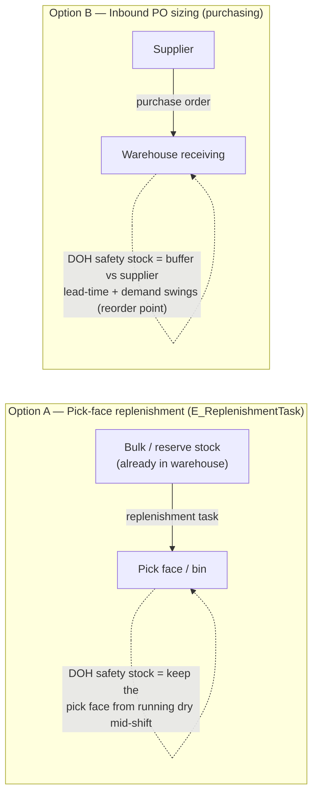

# BMS-5068 — Safety Stock Controls re-scope (resolution)

> [!success] Decision (v1)
> The override **engine already shipped** under BMS-4609 — **close BMS-4217 as a duplicate**, don't rebuild. v1 safety stock = **SKU+location grain only** (supplier-tier deferred until proven needed). Order sizing **rounds to layer/pallet**. **Open for the refinement meeting:** does DOH order-sizing apply to **pick-face replenishment** or **inbound PO sizing**? (see decision brief below).

## Decisions

| # | Question | Decision | Status |
|---|---|---|---|
| Q1 | Rebuild the override engine? | **No — close BMS-4217 as duplicate.** `SKU_Override__c` + `Inventory_Threshold__c` + `S_InventoryThresholds.resolve()` already shipped (BMS-4609, Done). | ✅ confirmed |
| Q2 | Supplier-tier safety stock? | **Deferred. v1 = SKU+location only.** The tier *exists* in code (`Inventory_Threshold__c.Account__c`) but has zero confirmed demand — don't switch it on until Gulf proves the need. | ✅ confirmed (defer) |
| Q3 | Order-sizing rounding | **Round to layer/pallet** (standard in beverage DSD). | ✅ confirmed |
| Q4 | Where does DOH order-sizing live? | **OPEN — for refinement meeting.** Pick-face replenishment (`E_ReplenishmentTask`) vs. inbound PO sizing. See brief. | 🟠 open |

### AI-assumed vs confirmed (for the refinement review)
- **AI-auto-filled (assumed, then confirmed by owner):** close 4217 as dup; layer/pallet rounding; defer supplier-tier.
- **AI-found fact (code evidence, not an assumption):** the engine + supplier tier already exist on main; DOH currently only affects replenishment *priority*, never order *quantity*.
- **Still open for the team:** Q4 (pick-face vs inbound PO) — the business language in the epic ("supplier lead-time variability, seasonal demand") leans toward purchasing, but the only existing DOH consumer is pick-face replenishment. **Needs the team to confirm intent.**

## Re-scoped BMS-5068 (v1, net-new only)
1. **DOH-driven order sizing** — make the resolved target DOH actually size orders (today `E_ReplenishmentTask` sizes purely from bin capacity `Max_Capacity__c − currentCases`; DOH only nudges priority, lines ~353-369). Target: `targetCases = round(targetDOH × Average_Daily_Depletion__c ÷ Units_Per_Case__c)`, then **round to layer/pallet**, clamped to bin capacity. Fall back to today's capacity-fill when DOH/velocity is null (un-configured SKUs unchanged).
2. **Re-point BMS-4217** as the test/coverage child for #1 (not a 4025 re-demo).
- Supplier tier: **not built in v1** (relationship exists via `Item_Line__r.Supplier__r` — can be switched on later by passing the supplier `accountId` into `resolve()`).

## How we reached the conclusion (evidence)
- Engine shipped: `S_InventoryThresholds.cls` (`resolve()`/`resolveAll()`, precedence SKU-override → Account+Location → Location → Account), `SKU_Override__c`, `Inventory_Threshold__c`. DOI/velocity: `S_InventoryDOI.cls`, `Inventory__c.Current_DOI__c`/`Average_Daily_Depletion__c`/`Effective_Target_DOH__c`.
- Supplier tier exists but dead: `Inventory_Threshold__c.Account__c` is the supplier dimension; callers pass `accountId = null` (`E_ReplenishmentTask` line ~353, `S_InventoryDOI` note ~19-21), so it never resolves.
- 4217 = byte-identical clone of the Done 4025 demo → pure duplication.

---

# 🟠 Decision brief — where does DOH order-sizing belong? (for product refinement)

> 📄 **Meeting-ready page:** [BMS-5068-replenishment-vs-po-brief.html](BMS-5068-replenishment-vs-po-brief.html) — styled standalone HTML (open in a browser) of the brief below, for screen-sharing in refinement.

**The question in one line:** when "safety stock" raises a target, should it change **how much we move to the pick face inside the warehouse**, or **how much we buy from the supplier**?

**What each means**
- **Option A — pick-face replenishment:** product you *already own* moves from bulk to the pick location. Safety stock here protects against a bin going empty during a shift. *This is the only place DOH is wired in today (`E_ReplenishmentTask`).*
- **Option B — inbound PO sizing:** deciding how many cases to *order from Red Bull / the supplier*. Safety stock here is a **reorder buffer** against lead-time variability and seasonal swings. *No DOH consumer exists here yet — would live in purchasing (`E_PurchaseOrder`).*

**The tension to resolve with the team:** the epic's business description ("supply chain disruptions, **supplier lead-time variability**, **seasonal demand swings** require elevating buffers") sounds like **Option B (purchasing)**. But the existing code hook is **Option A (pick-face)**. They're different builds in different places.

**Recommendation to bring to the meeting:** confirm intent first. If the goal is "don't run out because the *supplier* is slow/seasonal," it's **Option B (reorder-point / PO sizing)**. If it's "don't let the *pick face* go dry," it's **Option A**. My read of the wording → **Option B**, but the cheap/already-wired path is **A** — so it's a genuine product call, not a code call.

**Decision needed from team:** A, B, or both — and if B, whether it belongs in this epic or a purchasing epic.

---
v1 decisions resolved 2026-06-29 (owner + code-grounded SME). Q4 framed for the product refinement meeting. Posted to BMS-5068.
