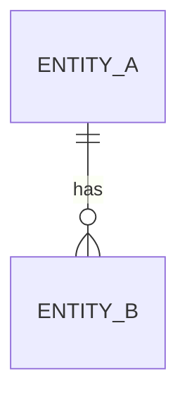

# 🟦 Feedback Needed — [Epic title] ([BMS-XXXX](https://ohanafy.atlassian.net/browse/BMS-XXXX))

> **In one line:** what this epic delivers, and the single thing blocking it — *we need your direction on the decisions below to start building.*

## 📌 Epic at a glance
- **Epic:** BMS-XXXX — _one-sentence summary in plain language (no jargon)._
- **Where we are:** ready to build **except** the open questions below.
- **What we need from you:** a quick call on each ⬇️ — comment inline, no meeting needed.

## 🖼️ The idea (high level)
_Keep it conceptual — a sketch of the experience or the data model, not technical detail._

<!-- OR embed a mockup screenshot instead of (or with) the diagram: -->
<!--  -->

---

## ❓ Open questions — by ticket
> One block per ticket that has an open question. Plain language. End each with the **decision we need**.

### BMS-YYYY — [ticket summary]
- **The issue:** what's unclear or the friction, in business terms.
- **Business impact:** what it costs the user/business if left unresolved or built the wrong way.
- **Direction we're leaning:** the solution path we'd take (1–2 lines).
- **👉 Decision we need from you:** _the specific question — phrased so a yes/no or pick-one answer unblocks us._

### BMS-ZZZZ — [ticket summary]
- **The issue:**
- **Business impact:**
- **Direction we're leaning:**
- **👉 Decision we need from you:**

---

## ✅ TL;DR — the decisions, all in one place
1. **BMS-YYYY:** _the one-line decision._
2. **BMS-ZZZZ:** _the one-line decision._

_Comment next to any item, or reply with the numbers + your call. Once answered, this unblocks the build immediately._

---
Internal links: [[BMS-XXXX]] (epic note) · granular questions in `Open-Questions/`. Generated by `/conductor`.
