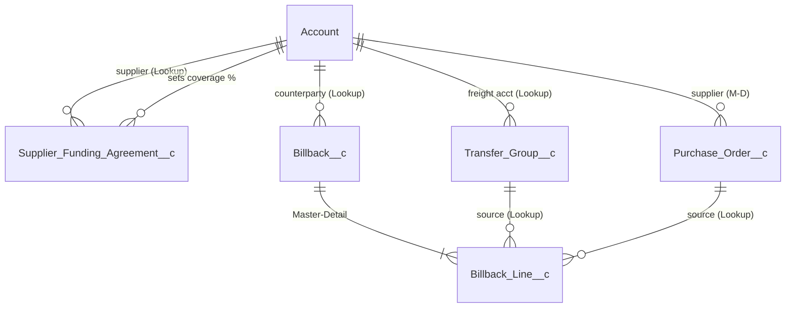
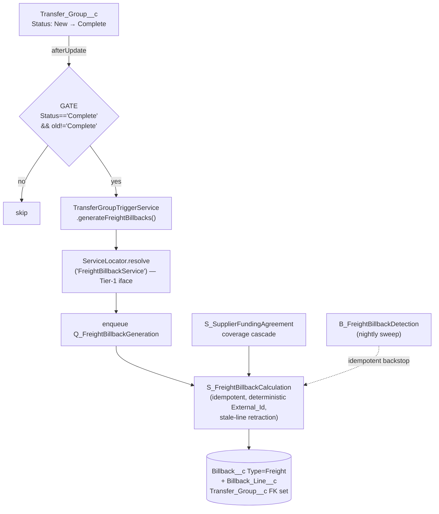
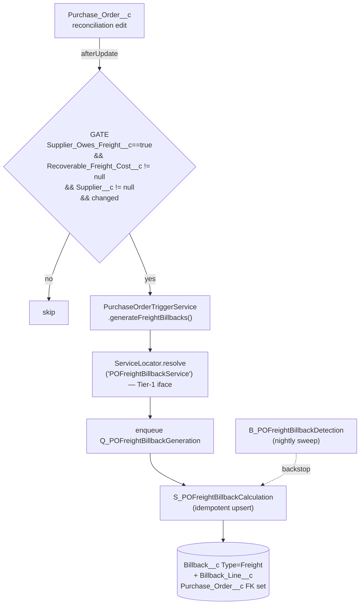
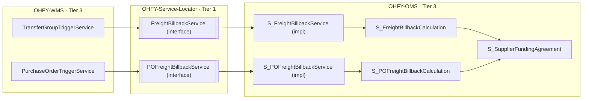
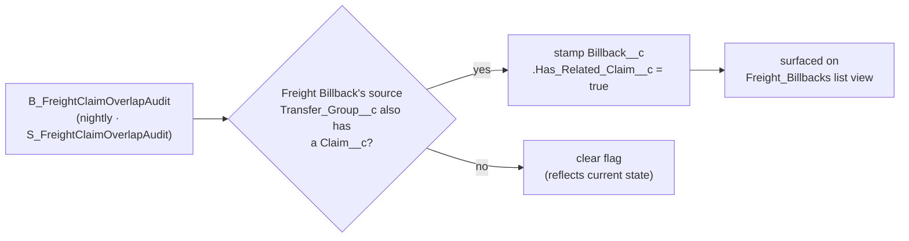

# 🧭 ERD & Flows — Supplier Freight Cost Billbacks (BMS-5161)

> **The whole picture on one page.** Freight billback is **not** a new recovery
> system — it is a new `Type__c = 'Freight'` on the already-shipped **BMS-4141**
> `Billback__c` ledger, fed by **two new source triggers**: a completed
> cross-state **Transfer**, and a **reconciled PO.** Reuse the trunk; add two doors.

---

## 1. Data model — DBML ER

> Paste into [dbdiagram.io](https://dbdiagram.io) for an interactive render.
> `_c` = custom object, `_r` = relationship. All FKs verified in
> `OHFY-Data-Model/force-app/main/default/objects/*/fields`.

```dbml
// ─────────────────────────────────────────────────────────────
//  Supplier Freight Cost Billbacks (BMS-5161)
//  Bedrock (BMS-4141): Account, Supplier_Funding_Agreement__c,
//                      Billback__c, Billback_Line__c
//  New this epic:      freight fields on Transfer_Group__c (5789)
//                      + Purchase_Order__c (5791); Type='Freight'
// ─────────────────────────────────────────────────────────────

Table Account {
  Id   varchar [pk]
  Name varchar
  Note: 'Standard object. THREE roles here: (1) Billback counterparty, (2) Transfer recoverable-freight account, (3) PO supplier.'
}

Table Supplier_Funding_Agreement__c {
  Id                  varchar [pk]
  Supplier__c         varchar [ref: > Account.Id]   // Lookup
  Brand__c            varchar
  Coverage_Default__c number                          // % Gulf may recover — drives coverage
  Floor_Price__c      number
  State__c            varchar
  Start_Date__c       date
  End_Date__c         date
  Is_Active__c        boolean
  External_Id__c      varchar [unique]
  Note: 'BMS-4141. Coverage cascade: agreement Coverage_Default__c -> account default -> 100% cap.'
}

Table Transfer_Group__c {
  Id                             varchar [pk]
  Status__c                      varchar   // New -> In Progress -> Complete
  //  ── BMS-5789 / PR #511 (source-agnostic capture) ──
  Freight_Cost__c                number    // Currency(18,2)
  Freight_Cost_Source__c         varchar   // Picklist: Truck Builder | Manual | Import | API
  Recoverable_Freight_Account__c varchar [ref: > Account.Id]   // Lookup — who owes it
  Is_Cross_State__c              boolean   // Formula: Origin state <> Destination state
  Note: 'OHFY-WMS. Freight capture point. NOT coupled to the truck-builder flow.'
}

Table Purchase_Order__c {
  Id                          varchar [pk]
  Status__c                   varchar
  Supplier__c                 varchar [ref: > Account.Id]   // Master-Detail (pre-existing)
  //  ── BMS-5791 / PR #516 (2nd origination path) ──
  Supplier_Owes_Freight__c    boolean   // set at reconciliation — THE trigger signal
  Recoverable_Freight_Cost__c number    // Currency(18,2)
  Note: 'OHFY-WMS. Second freight door: PO reconciliation, freight-scoped only.'
}

Table Billback__c {
  Id                          varchar [pk]
  Account__c                  varchar [ref: > Account.Id]   // Lookup — counterparty-generic
  Type__c                     varchar   // Billback|Rebate|Sample|Incentive|Generic|Co-op|MDF|FREIGHT
  Status__c                   varchar
  Coverage_Percent__c         number
  Total_Recoverable_Amount__c number
  Has_Related_Claim__c        boolean   // BMS-5790 AC4 — stamped by the overlap audit
  External_Id__c              varchar [unique]   // deterministic -> idempotent upsert
  // + Budget__c, Charge_Date__c, Incentive__c, Is_Active__c, Memo__c,
  //   Outstanding_Cases__c, Revenue_Amount__c, Total_Cases__c
  Note: 'BMS-4141 ledger (15 fields). Freight billbacks are simply Type__c = Freight.'
}

Table Billback_Line__c {
  Id                    varchar [pk]
  Billback__c           varchar [ref: > Billback__c.Id]          // Master-Detail
  Transfer_Group__c     varchar [ref: > Transfer_Group__c.Id]    // Lookup — set on transfer-sourced lines
  Purchase_Order__c     varchar [ref: > Purchase_Order__c.Id]    // Lookup — set on PO-sourced lines
  Inventory_Adjustment__c varchar
  Invoice_Item__c       varchar
  Amount__c             number
  Recoverable_Amount__c number
  Coverage_Percent__c   number
  External_Id__c        varchar [unique]
  Note: 'The ledger lines. The source FK (Transfer OR PO) is what BMS-5161 populates.'
}
// @view 184 36 0.361
```

### The same ERD, rendered



**Read it in one breath:** an `Account` shows up three ways. Its
`Supplier_Funding_Agreement__c` says what % is recoverable. A completed
`Transfer_Group__c` or a reconciled `Purchase_Order__c` becomes a
`Billback__c` (Type = Freight) with one `Billback_Line__c` that points *back*
at whichever source created it.

---

## 2. Flow A — Transfer → Complete → Billback



- **Gate** (`TransferGroupTriggerService.generateFreightBillbacks`): fires
  **only** on the `New/In-Progress → Complete` transition — `Status__c == 'Complete' && old != 'Complete'`. This is the literal "set to complete" trigger.
- Trigger never fails the transfer save — a billback-side error is logged and
  the nightly `B_FreightBillbackDetection` regenerates it.

---

## 3. Flow B — PO → Reconciliation → Billback



- **Key difference from Flow A:** the PO path fires on the **freight-owed
  reconciliation signal** (`Supplier_Owes_Freight__c` set + amount/supplier
  present + changed), **not** on `Status = Complete`. Same end result — a
  freight `Billback__c` — different trigger point, by design (freight on a PO
  is *discovered at reconciliation*, a separate act from the PO closing).

---

## 4. Cross-tier architecture — why WMS never touches OMS directly



WMS and OMS are **sibling Tier-3 packages** — WMS can't compile against an OMS
concrete type. So the trigger resolves an **interface registered in the Tier-1
Service-Locator**, and OMS supplies the implementation at runtime. Exact same
seam as the shipped `DeliveryUpdaterService`.

---

## 5. Overlap audit (BMS-5790 AC4)



Closes the freight-vs-claim **double-recovery** gap: if Gulf already filed a
`Claim__c` on the same shipment, the freight billback is flagged for manual
review rather than silently double-recovering. Idempotent — the flag always
reflects current state on recompute.

---

## 6. The money, end to end (live-verified)

| Source | Cost | Coverage (funding agreement) | Recoverable billback |
| --- | --- | --- | --- |
| Cross-state Transfer | $1,200 | 40% | **$480** |
| PO reconciliation | $300 | 40% | **$120** |

Both generated by the **real trigger hooks** in `bms-5113-5161-integration`, not direct service calls.

---

## 🧠 Mnemonic — reload the whole picture in two lines

> **"Two doors, one ledger — freight is a *Type*, not a system."**
> Door 1 = Transfer *on Complete*. Door 2 = PO *on reconciliation*. Both walk
> the same hallway: **G · R · E · C** — **G**ate → **R**esolve (Service-Locator) →
> **E**nqueue → **C**alculate (idempotent upsert into `Billback__c`/`Billback_Line__c`).

If you can say *"two doors, one ledger"* and unpack *G-R-E-C*, you can draw this
diagram and defend the design in a review without notes.
