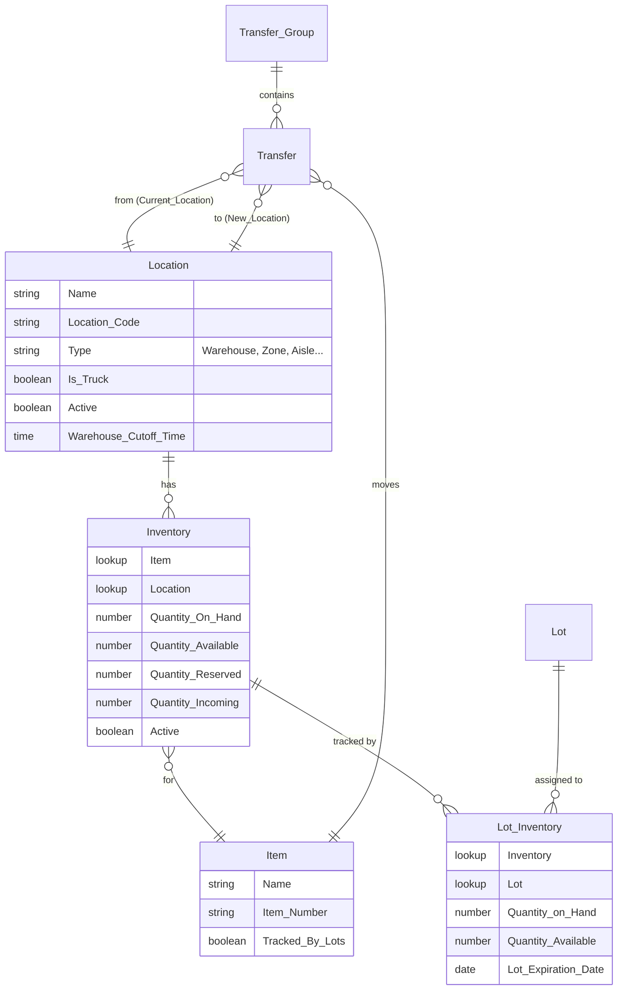
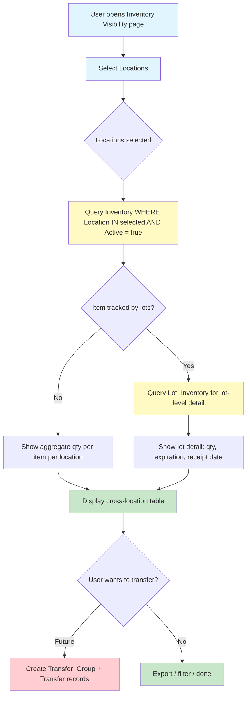

# BMS-3823: Inter-Warehouse Inventory Visibility

- **Jira**: https://ohanafy.atlassian.net/browse/BMS-3823
- **Type**: Story | **Status**: To Do | **Priority**: TBD
- **Assignee**: Alvaro Sanchez

---

## What Is This

Gulf has 5 warehouses that operate as separate inventory pools. Nobody can see what sibling warehouses have. Sales reps oversell from depleted locations while surplus sits idle at others.

## Story Statement

> As a **Gulf Inventory Analyst**, I want **inter-warehouse inventory visibility**, so that **warehouse managers and sales ops can identify available stock across all 5 Gulf locations and in-transit trucks before placing transfer requests or committing to customer orders.**

---

## Data Model (OHFY-Core)



---

## Proposed Solution

### LWC: `inventoryCrossLocation`

A single-page component where users select locations and see aggregated stock levels across all selected warehouses — both lot-tracked and non-lot-tracked items.



### Key Features

**Location Selector**
- Multi-select from `Location__c WHERE Type__c = 'Warehouse' AND Active__c = true`
- Default: all 5 Gulf warehouses pre-selected
- Option to include truck locations (`Is_Truck__c = true`)

**Inventory Table**
- Columns: Item Name, Item Number, Location 1 Qty, Location 2 Qty, ... , Total
- Color coding: red (0), orange (low), green (healthy)
- Toggle: show lot detail or aggregate only
- Search/filter by item name or item number

**Lot Detail (expandable rows)**
- Lot Identifier, Qty on Hand, Qty Available, Expiration Date, Receipt Date
- Highlight lots expiring within 30 days

**In-Transit View**
- Query `Transfer__c WHERE Status != 'Complete'` grouped by item
- Show: item, from location, to location, qty, transfer date

### Apex Controller

```
@AuraEnabled
public static List<InventoryRow> getInventoryAcrossLocations(List<Id> locationIds) {
    // Query Inventory__c WHERE Location__c IN :locationIds AND Active__c = true
    // Join with Item__c for name, item number, Tracked_By_Lots__c
    // For lot-tracked items, sub-query Lot_Inventory__c
    // Return structured list with per-location quantities
}

@AuraEnabled
public static List<TransferRow> getInTransitTransfers(List<Id> locationIds) {
    // Query Transfer__c via Transfer_Group__c WHERE Status != 'Complete'
    // WHERE Current_Location__c IN :locationIds OR New_Location__c IN :locationIds
}
```

### MVP Scope
- [x] Multi-location selector
- [x] Aggregated inventory table (qty per item per location)
- [x] Lot detail expandable rows
- [x] Search/filter
- [x] In-transit transfers view
- [ ] Transfer initiation (future — BMS separate ticket)
- [ ] Export to CSV (future)
- [ ] Days-on-hand calculation (future)

---

## Questions for Refinement

1. Should this live as a Salesforce tab (internal) or Experience Cloud page?
2. Access control — all users see all 5 warehouses, or filtered by user's location?
3. Is there a minimum qty threshold that should trigger visual alerts?
4. Should in-transit include Purchase Orders (incoming from suppliers)?
