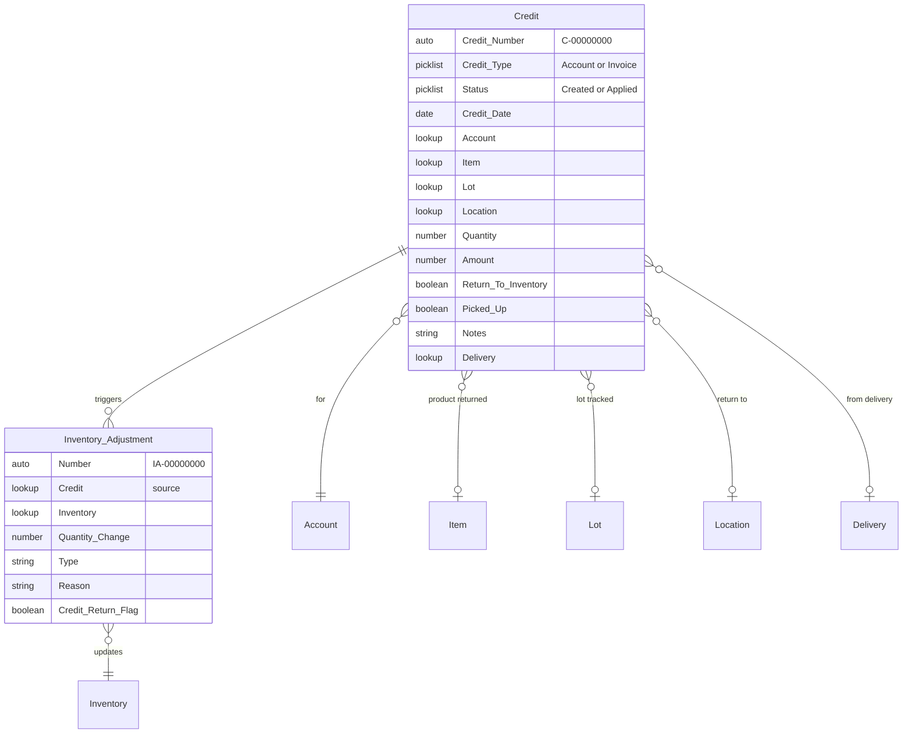
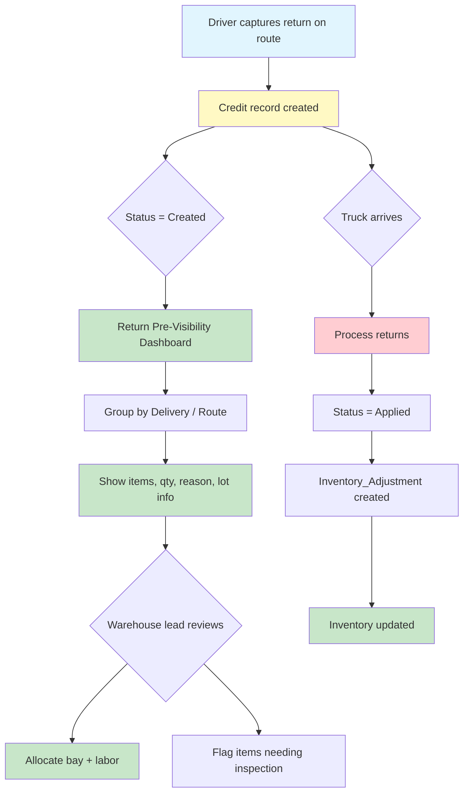
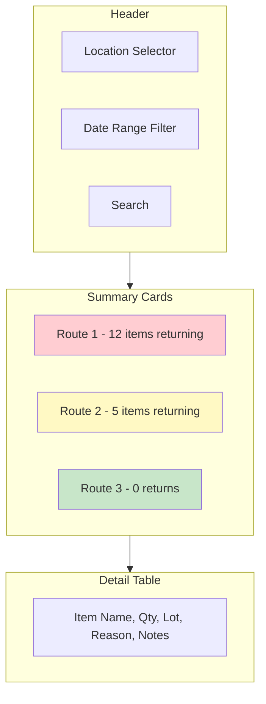
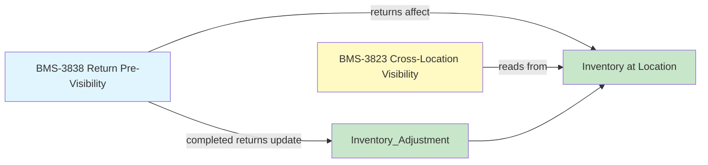

# BMS-3838: Return Pre-Visibility

- **Jira**: https://ohanafy.atlassian.net/browse/BMS-3838
- **Type**: Story | **Status**: To Do | **Priority**: TBD
- **Assignee**: Alvaro Sanchez

---

## What Is This

Warehouse supervisors need to know what's coming back on delivery trucks before the trucks arrive. Returns currently show up unannounced, competing with outbound operations.

## Story Statement

> As a **Gulf Delivery Driver**, I want **return pre-visibility**, so that **warehouse supervisors can staff unloading bays and allocate restocking labor before return trucks arrive.**

---

## Data Model (OHFY-Core)

Returns are handled through the `Credit__c` object — there is no separate `Return__c`.



---

## Proposed Solution

### LWC: `returnPreVisibility`

A dashboard component showing all **pending returns** (Credits with `Status__c = 'Created'` and `Return_To_Inventory__c = true`) grouped by delivery route/truck, giving warehouse leads advance notice.



### Key Features

**Incoming Returns View**
- Query: `Credit__c WHERE Status__c = 'Created' AND Return_To_Inventory__c = true`
- Grouped by: Delivery/Route (via `Delivery__c` lookup)
- Shows: Item name, qty, lot (if tracked), reason/notes, credit date
- Color coding: red for high qty, orange for lot-tracked (needs inspection), green for standard

**Route/Truck Summary**
- Card per delivery route showing total items returning, total qty, ETA (if available)
- Expandable to see line-level detail

**Filters**
- Date range (today, tomorrow, this week)
- Location (which warehouse is receiving)
- Item search

**Lot-Tracked Returns**
- Highlight items where `Lot__c` is populated
- Show lot expiration date — flag if expired (may not be restockable)

### Apex Controller

```
@AuraEnabled
public static List<ReturnSummary> getPendingReturns(Id locationId, Date fromDate, Date toDate) {
    // Query Credit__c WHERE Status__c = 'Created' 
    //   AND Return_To_Inventory__c = true
    //   AND Location__c = :locationId
    //   AND Credit_Date__c >= :fromDate AND Credit_Date__c <= :toDate
    // Include: Item__r.Name, Item__r.Item_Number__c, Lot__r.Lot_Identifier__c,
    //          Lot__r.Expiration_Date__c, Delivery__r.Name, Quantity__c, Notes__c
    // Group by Delivery__c for route-level summary
}
```

### Dashboard Layout



### MVP Scope
- [x] Pending returns query (Status = Created, Return_To_Inventory = true)
- [x] Group by delivery/route
- [x] Item detail with qty, lot info, reason, notes
- [x] Location filter
- [x] Date range filter
- [x] Lot expiration flagging
- [ ] Push notification to warehouse lead (future)
- [ ] ETA calculation based on route progress (future)
- [ ] Integration with driver handheld app (future — data already captured)

---

## Relationship to BMS-3823

These two tickets are complementary:



- Returns (3838) **write** to inventory — knowing what's coming back affects available qty
- Cross-location visibility (3823) **reads** from inventory — seeing all locations includes pending returns
- Both share the same `Inventory__c` + `Location__c` data model

---

## Questions for Refinement

1. Where does this dashboard live — internal Salesforce tab or distro app? 
- Home Page
1. Does the `Credit__c.Delivery__c` lookup reliably capture which route the return is coming from?
2. Is there a status between "Created" (on route) and "Applied" (processed) that we should use, or do we add one?
3. Should warehouse leads be able to flag/triage items from this dashboard (e.g., "needs inspection", "refuse return")?
4. How granular is route ETA — do we have truck GPS data or just route completion status?

