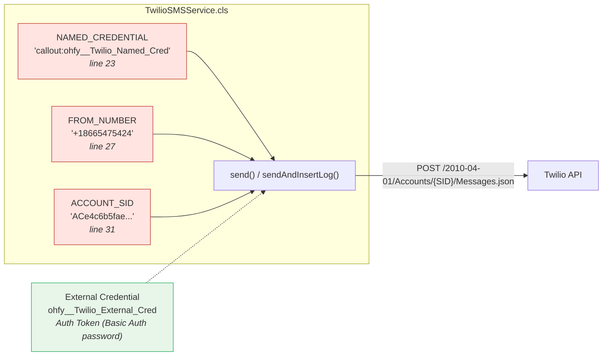
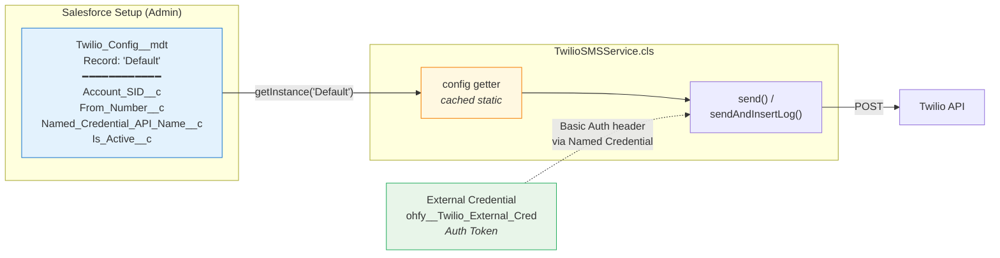
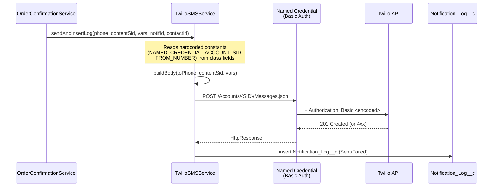
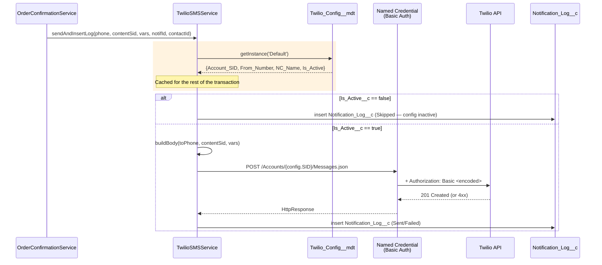
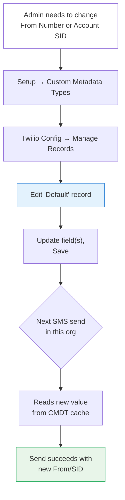
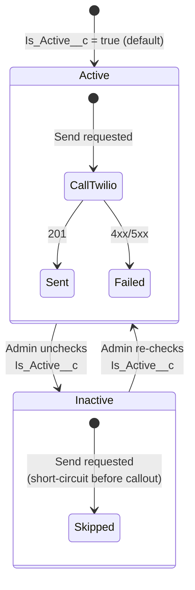
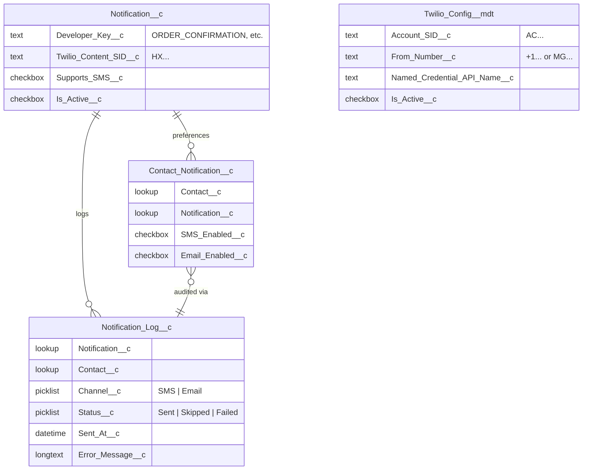
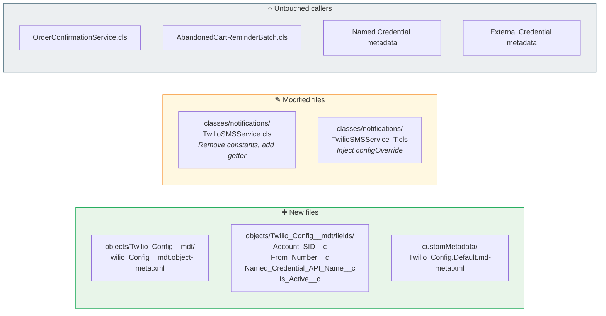
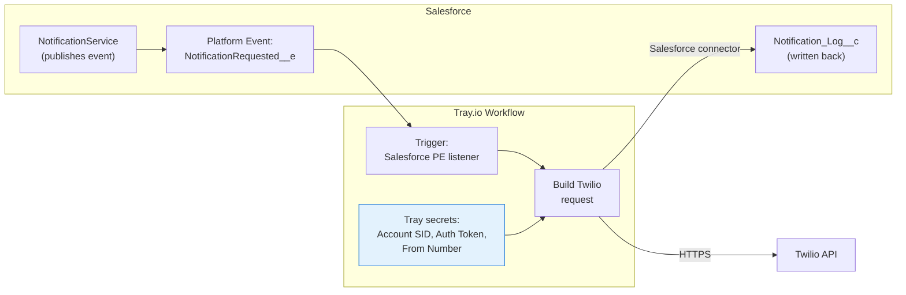
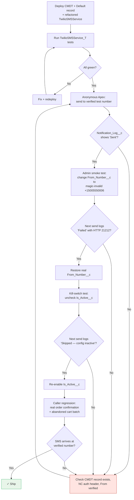

# Twilio — New Configurable Workflow

> **Goal**: Lift the three hardcoded Twilio values out of `TwilioSMSService.cls` (Account SID, From Number, Named Credential name) into admin-editable Salesforce configuration. Keep all existing send behavior intact.
>
> **Recommended solution**: Native Salesforce `Twilio_Config__mdt` Custom Metadata Type with a single `Default` record. Tray.io kept as a documented alternative.

## Related
- [[E-Commerce - Twilio Set up]] — current setup manual (the doc this workflow replaces parts of)
- [[E-Commerce - Rotate Twilio API credentials to remediate unauthorized account access]] — why getting secrets out of code matters
- [[Twilio Workflow]] — original workflow diagram
- Plan file (local): `~/.claude/plans/id-like-to-remove-stateless-coral.md`

---

## 1 — Current State (Problem)

Three values are hardcoded in `TwilioSMSService.cls`. Every environment swap (sandbox → prod, dev → QA) or rebrand requires editing Apex and redeploying.



| Symbol | Meaning |
|---|---|
| 🟥 Red boxes | Hardcoded — require code edit + deploy to change |
| 🟩 Green boxes | Already correctly externalized |

**Auth Token is fine** — it lives on the External Credential Principal (Basic Auth password) and never appears in code. The problem is the three URL/routing values that *should* be config but aren't.

---

## 2 — Proposed State (Solution)

Introduce `Twilio_Config__mdt` as a thin config layer between the service and the API. The service reads it once per transaction (cached) and proceeds exactly as before.



| Symbol | Meaning |
|---|---|
| 🟦 Blue | New admin-editable config layer |
| 🟩 Green | Unchanged — still owns the secret |
| 🟨 Yellow | New cached getter inside the service |

### Why Custom Metadata Type
- **No deploy to change a value** — admin edits in Setup UI.
- **Deployable defaults** — the `Default` record ships in `force-app/main/default/customMetadata/` so fresh orgs get sensible values on first deploy.
- **No SOQL cost** — `getInstance()` doesn't count against query limits.
- **Test-friendly** — `@TestVisible` override slot lets tests inject fakes without inserting CMDT records (which Apex tests can't do anyway).
- **Auth stays put** — Account SID is *also* the Basic Auth username on the External Credential. We're not duplicating the secret; we're storing the SID separately because it's *also* needed in the URL path, not just for auth.

---

## 3 — Send Sequence (Before vs After)

Side-by-side of an order confirmation send. The only difference is the orange step — a cached config read at the top.

### 3a — Current



### 3b — Proposed



**No signature changes.** `OrderConfirmationService` and `AbandonedCartReminderBatch` call the service exactly as they do today.

---

## 4 — Admin Edit Workflow

What an admin does when the Twilio account changes (e.g., new From Number purchased, or sandbox uses a different Account SID).



**Total time**: ~30 seconds. **Deploy required**: no. **Code change**: none.

Contrast with today: open `TwilioSMSService.cls` → edit lines 27/31 → commit → PR review → merge → deploy → smoke test → done. ~2 hours minimum, longer if a release window is required.

---

## 5 — Kill-Switch Behavior

The `Is_Active__c` flag is a cheap incident-response lever. If Twilio is degraded, a Twilio account is suspended, or the team needs to silence all outbound SMS during a sensitive customer event, an admin can flip one checkbox and *all* sends short-circuit to `Skipped` — no failed callouts, no error noise in `Notification_Log__c`, no governor limit pressure.



When `Inactive`:
- `Notification_Log__c.Status__c = 'Skipped'`
- `Notification_Log__c.Error_Message__c = 'Twilio config inactive'`
- Zero HTTP callouts → zero governor limit consumption → safe to leave off indefinitely.

---

## 6 — Data Model (Unchanged)

The notification framework's object model is untouched. The new `Twilio_Config__mdt` sits next to it, not inside it.



`Twilio_Config__mdt` is intentionally isolated — it has no relationships to the notification data because it's infrastructure config, not business data.

---

## 7 — Code Changes (Scope)



---

## 8 — Alternative: Tray.io (Documented, Not Recommended Today)

Captured because it was previously suggested. The engineer who proposed it has since left, so it's preserved here as a deliberate-revisit option rather than tribal knowledge that will get rediscovered later.



### When Tray would be the right call
- Multi-channel orchestration coming (WhatsApp, push, multiple SMS vendors) — one playbook beats one service per channel.
- Need visual retry/backoff/branching that's painful to express in Apex.
- Compliance requires PII never lands in Salesforce-side logs.
- Team-wide iPaaS strategy already in place.

### Why not now
- **None of the above apply today** — one channel, one vendor, low volume.
- Adds vendor cost + contract.
- Adds a new failure surface (Tray uptime, connector auth refresh, workflow versioning).
- Doesn't solve "hardcoded values" any better than CMDT — Tray secrets are just config in a different system.

### Tradeoff matrix

| Concern | CMDT (recommended) | Tray.io |
|---|---|---|
| Admin can change values without deploy | ✅ Setup UI | ✅ Tray UI |
| New vendor / contract / cost | ❌ none | ⚠️ yes |
| New failure surface | ❌ none | ⚠️ Tray uptime + connector |
| Multi-channel orchestration | ⚠️ one service per channel | ✅ central playbook |
| Time-to-implement | ✅ ~1 day | ⚠️ multi-week |
| PII out of Salesforce logs | ❌ no change | ✅ possible |
| Reversibility | ✅ trivial | ⚠️ migration cost both ways |

**Verdict**: CMDT now. Revisit Tray (or any iPaaS) when a second channel/vendor enters the picture, not before.

---

## 9 — Verification Plan



---

## 10 — Summary

| Question | Answer |
|---|---|
| Is Tray the only option? | No. Custom Metadata is the recommended path for this scope. |
| Will existing functionality break? | No. Call signatures unchanged; defaults shipped with the CMDT seed record. |
| How long to implement? | ~1 day (object + fields + seed record + service refactor + tests + docs). |
| Future migration to Tray possible? | Yes — the service is the only abstraction layer; swapping it for a Platform Event publisher is contained. |
| What does "hardcoded" really mean today? | Three values in one file. The Auth Token is already correctly externalized; we're finishing the job. |


```
wait wouldnt Twilio_Config__mdt be visible within the 
admin data? wouldnt that pose a risk?


leaving Account_SID__c and From_Number__c             
Named_Credential_API_Name__c and Is_Active__c?   

```     

⏺ Good catch — that's exactly the right question to ask
before shipping. Pausing implementation to address it.
∞
Short answer: the four CMDT fields are not
credentials, so admin visibility is not a security
risk by itself. Here's the breakdown:

Field: Account_SID__c
Sensitivity: Low
Why: An identifier, not a credential. Your own setup
doc says it (line 2): "Account SID alone cannot
authenticate or make API calls — it's an
identifier,
not a credential. Without the Auth  Token paired
with it, it's useless for sending  messages."
────────────────────────────────────────
Field: From_Number__c
Sensitivity: None
Why: A public-facing phone number. Anyone who ever
received an SMS from us already saw it. It's also in

Twilio regulatory filings, the toll-free
verification
record, etc.
────────────────────────────────────────
Field: Named_Credential_API_Name__c
Sensitivity: None
Why: Salesforce metadata API name. Already visible to
anyone with Setup access; not a secret.
────────────────────────────────────────
Field: Is_Active__c
Sensitivity: None
Why: A boolean toggle.

The actual credential — the Auth Token — never enters
the CMDT. It stays where it already is: encrypted on
the External Credential Principal (Basic Auth
password). That separation is the whole point: the SID
is useless without the token, and the token isn't
here.